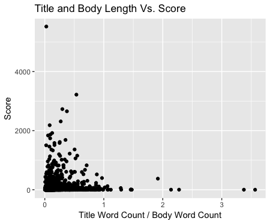
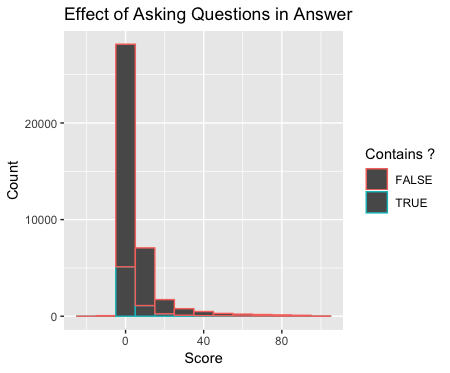

```{r setup, include=FALSE}
knitr::opts_chunk$set(echo = TRUE)
```

# IT'S ALMOST SPRING BREAK (AND I'M READY TO GIVE 0% EFFORT ON THIS LAB)

## Timeliness of a Post (GROUP)
```{r, eval=FALSE}
library(hms)

time <- QnA%>%
  select(Qid, QDate, ADate, AScore)

etime <- time%>%
  mutate(Etime= ADate-QDate)

etime1 <- etime%>% 
  filter(Etime >= 0)%>%
  mutate(Etimeh= as.hms(Etime))

etime2 <- etime1%>%
  filter(Etime<= 604800)

ggplot(etime1)+
  geom_point(mapping= aes(x=Etimeh, y=AScore))+
  labs(x= "Time Elapsed", y= "Answer Score", 
       title= "Time Elapsed and Answer Score")

ggplot(etime2)+
  geom_point(mapping= aes(x=Etimeh, y=AScore))+
  labs(x= "Time Elapsed", y= "Answer Score", 
       title= "Time Elapsed and Answer Score")
```


As you can see from the plot above, time does not really play into the overall score of an answer post unless the answer is made within a 50 day range (2400:00:00 denotes 100 days have passed). Even looking at a smaller timescale (168:00:00is one week), the conclusion that the less time that elapses between a question and answer could possibly increase answer scores.

## Other Important Features (SUMMARY OF INDIVIDAL)
If someone refers to a link in their answer, they are more likely to get a better score/upvote.

---

### Chris
__Question:__ do answers that contain a link in them get more upvotes? 


```{r, eval=FALSE}

links <- answersj %>%
  select("Score", "Body")

containslink <- links %>%
  filter(str_detect(Body, "http")) %>%
  select(Score)

score_wlink <- containslink %>%
  transform(Score = as.numeric(Score)) %>%
  summarise(mean_score = mean(Score))

#average score which contain links and then average scores of ones that dont contain links and compare.

doesntcontainlink <- links %>%
  filter(!str_detect(Body,"http")) %>%
  select(Score)

score_wolink <- doesntcontainlink %>%
  transform(Score = as.numeric(Score)) %>%
  summarise(mean_score = mean(Score))

scorestotal = full_join(score_wlink, score_wolink) %>%
  mutate(Type = c("with link", "without link"))

ggplot(scorestotal) + 
  geom_col(aes(x = Type, y = mean_score, fill = Type)) + labs(x = "Does the answer include a link?", y = "Mean upvote", title = "Correlation between including links in answer and average upvotes") 

```

From the data, we can see that, on average, answers that provide a link to support their response receive a better score (16.53 upvotes on average) than those that do not (10.21 upvotes on average). To be exact answers that include links are 6.32 upvotes higher on average. 

I chose to analyze this feature because, in my experience, the answers that link to other articles are more intricate. Those answers tend to be very detailed, and the links are to either references, or to another article that can answer a specific aspect of the question in more detail. I was curious if the people who linked other sources would get higher upvotes because of this. 

Again, I think the reason that people who included links in their responses had a much higher average upvotes is due to them reffering to other sources when they know they are unable to adequately answer a specific portion of the question

### James
__Questions:__ Does the ratio of word count for the title and body affect the score? The feature I analyzed was this ratio. I don't believe there will be a strong correlation with this feature and scores, but I do believe that it's something to observe. Questions that have titles that are longer than their bodies have a ratio that is greater than one, and questions that have titles shorter than their bodies have a ratio less than one. My expectation is higher scored questions have a ratio less than 1. 

One can clearly see that there is some "correlation." As this ratio approaches 0, the range of scores increases. However, this could be due to short titles and descriptive body paragraphs. 

__Answers:__ Do answers that have question marks in them get more upvotes? The feature I analyzed was a catergorical variable, that outputs TRUE if there is a "?" and FALSE if not. I thought this was a reasonable feature because one would assume that the best answers don't actually respond with questions. 


For this plot, I actually limited my scores to 0-100 get a better representation of the majority of answers. There is also some correlation here. As the score increases, the percentage of answers not having a question mark Just like the feature for questions, this isn't a great feature if one wanted strong correlation. Also, because there are so many answers that get 0-1 upvotes, this feature might be best suited for answers that actually got higher scores. 

### Amanda 
__Questions:__ Do questions that include a question mark generally receive more upvotes than questions that do not include a question mark?

```{r, eval=FALSE}
questions %>% mutate()
```

__Answers:__ Do answers that use "I statements get more upvotes than ones that don't?"

```{r, eval=FALSE}

```

### Anna
__Question:__ Why are answers sometimes scored higher than questions?
I found this interesting because in most cases, you would expect the opposite (questions scored higher than answers) or an equal amount, as people score both questions and answers on relevancy to their life.

I first used the full join function to join the entire data set together by Id and Parent Id. I then created a category that reported the difference in answer score and question score. After that, I filtered the data so that the tibble would only show questions with answers scored higher than the original post. To plot the relation, I used a geom_point function 

```{r, eval=FALSE}
#Reading the Files
answers <- read_csv("Answers_trunc.csv", col_names = TRUE)%>%
  select (Id, OwnerUserId, CreationDate, ParentId, Score, Body)
View(answers)

questions <- read_csv("Questions_trunc.csv", col_name= TRUE)%>%
  select(Id, OwnerUserId, CreationDate, Score, Title, Body)
View(questions)

#Join Funciton
answersj <- answers%>%
  rename(AnswerId= Id, Id= ParentId)

QnA <- full_join(questions, answersj, by= "Id")%>%
  rename(QDate= CreationDate.x,
         QScore= Score.x,
         QTitle= Title,
         QBody= Body.x,
         ADate= CreationDate.y,
         AScore= Score.y,
         ABody= Body.y,
         AUserId= OwnerUserId.y,
         QUserId= OwnerUserId.x,
         Aid= AnswerId,
         Qid= Id
         )
  
QnA <- QnA%>%
  select(Qid, QTitle, QDate, QScore, QUserId, QBody, 
         Aid, ADate, AScore, AUserId, ABody)

#Creating the Difference Category
updoot <- QnA%>%
  mutate(Diff= AScore-QScore)%>%
  na.omit

updoot1 <- updoot%>%
  filter(Diff > 0)

#ggplot
ggplot (updoot1)+
  geom_point(mapping=aes(x=Diff, y=QScore, color=AScore))+
  labs(x= "Difference in Answer Score and Question Score", y= "Question Score", title= "What Questions Have Answers Rated Higher than the Question?")+
  scale_x_continuous(limits= c(0,2000))+
  scale_y_continuous(limits= c(0,2000))+
  scale_fill_manual(name= "Answer Score")+
  scale_color_gradient(low="blue", high="red")
```


From the graph, you can see that 

---

### Summary: 

__Chris:__ I tidyed the data by filtering through variable I didn't need. I then separated all the answers into ones that did and didn't contain a link to another source. After that, I averaged the scores/ upvotes for the respective groups with respect to links and then plotted the results using geom_bar. 

__James:__ I used dplyr and string functions for my features. I used geom_point and geom_histogram for my plots. 

__Amanda:__

__Anna:__