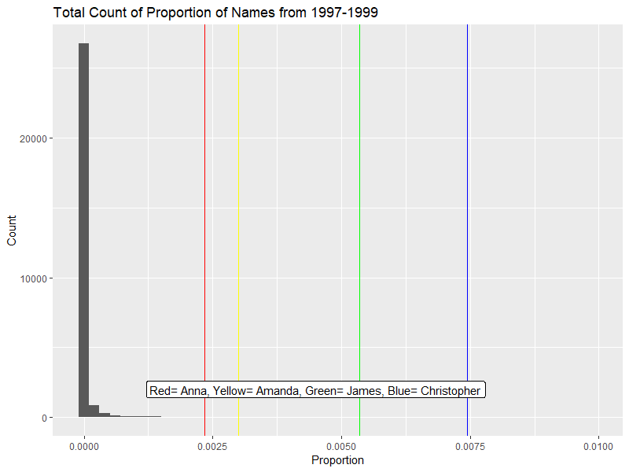
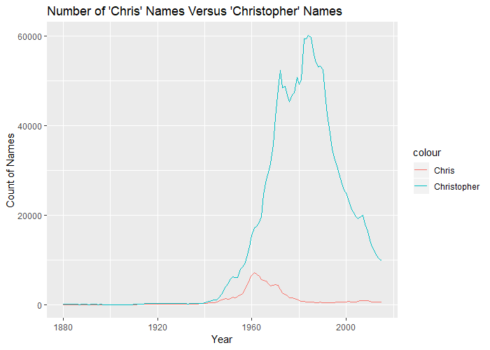

  
```{r setup, include=FALSE}
knitr::opts_chunk$set(echo = TRUE)
```

# The Name Game
## Ariel and Rachel
```{r, eval=FALSE}
babynames<- view(babynames)

fnames<- babynames%>%
  filter(sex=="F")

# Changed the years and name string ("Ra[ey]?ch")
fnamescount<- fnames%>%
  filter(year== 2017)%>%
  summarise(sum(str_detect(name, "Ar[iy]+.l") == T))

fnamestotal<- fnames%>%
  filter(year== 2017)%>%
  summarise(sum(n))
```

__Versions of Ariel and Rachel:__

Year  |Ariel    |Rachel 
------|---------|---------
1973  |3        |14
1988  |9        |22
1990  |10       |19

__Probability of Ariel and Rachel:__

Year  |Ariel     |Rachel 
------|----------|---------
1973  |3/1458168 |14/1458168
1988  |9/1780268 |22/1780268
1990  |10/1898046|19/1898046
2017  |20/1711811|7/1711811

## _The Littel_ Mermaid Effect
```{r, eval=FALSE}
ariel<- fnames%>%
  filter(str_detect(name, "Ar[iy]+.l"))%>%
  group_by(year)%>%
  summarize(sum(n))

asnamesp<- babynames%>%
  filter(str_detect(name, "^A"))%>%
  group_by(year)%>%
  summarise(Prop= mean(str_detect(name, "Ar[iy]+.l")))

fnamesp<- fnames%>%
  group_by(name)

ggplot()+
  geom_line(ariel, mapping=aes(x=year, y=`sum(n)`))+
  geom_vline(xintercept= 1989, col="blue")+
  geom_line(anames, mapping=aes(x=year, y=`sum(n)`))
```

__Popularity of Ariel versus other names:__


For this plot, we decided to look at the four most popular names in the years 1988-1990. These names were Amanda, Ashely, Jessica, and Sarah. From the plot, it's immediately clear that the proportion of those popular names have been decreasing while the proportion of Ariel names have been increasing. 

---

## Group Histogram
```{r, eval= FALSE}
#Filtering our years and summing total n
ournames<- babynames%>%
filter(between(year, 1997, 1999))%>%
group_by(name)%>%
mutate(Total= sum(n))

#Getting rid of multiple data
ournames2<- ournames%>%
filter(year==1999)%>%
mutate(Prop= Total/10994443)

#Counting totals of all Years  
ournames3<- babynames%>%
filter(between(year, 1997, 1999))%>%
mutate(oTotal=sum(n))

ggplot(ournames2)+
geom_histogram(mapping=aes(x=Prop), bins=50)+
geom_vline(xintercept= 0.002350005, col="Red")+
geom_vline(xintercept= 0.002996878, col="Yellow")+
geom_vline(xintercept= 0.005345064, col="Green")+
geom_vline(xintercept= 0.007447853, col="Blue")+
labs(title= "Total Count of Proportion of Names from 1997-1999", y= "Count", x="Proportion")+
annotate("Label", x = 0.0045, y = 2000, label = "Red= Anna, Yellow= Amanda, Green= James, Blue= Christopher")

```
 

We decided to do a histogram of the total count of the proportion of all names in 1997-1999. The graph below shows four lines representing our own name proportions. Since the data manipulations created a lot of extra data (i.e. each year would have multiple names with the correct total amount), we decided to use only the names from 1999 because the total amount of names was the largest, and thus the amount of missed names (names used in 1997 or 1998 but not 1999) would be less likely. 

For this graph, we decided to also not take gender into account. We also filtered our results by our exact name, not by a general version. 

---

## Chris
```{r, eval=FALSE}

chrisnames <-babynames %>%
  filter(str_detect(name, "[CK]hris$"), sex== "M")%>%
  group_by(year) %>%
  summarise(sum(n)) %>% rename(count = 'sum(n)')


christophernames <- babynames %>%
  filter(str_detect(name, "[CK]hristopher"), sex== "M") %>%
  group_by(year) %>%
  summarise(sum(n)) %>% rename(count = 'sum(n)')

allchris <- left_join(chrisnames,christophernames, by = 'year') %>%
  rowSums()

ggplot()+
  geom_line(chrisnames, mapping=aes(x= year, y=count, color="Chris"))+
  geom_line(christophernames, mapping=aes(x= year, y= count, color= "Christopher"))+
  xlab("Year")+
  ylab("Count of Names")+
  ggtitle("Number of 'Chris' Names Versus 'Christopher' Names") 

```



In the above plot, we can see that the name Chris and Christopher was fairly unpopular until about 1940, and then the name Christopher grew much faster than Chris. The name of just Chris spiked at 1960 and then decreased while the name Christopher kept increasing. Presumably, the legal name of Christopher became much more common than just Chris. 

```{r, eval = FALSE}

chris <- babynames %>% 
  filter(str_detect(name, "[Ck]hris"), sex=="M") %>% 
  group_by(year)

#Proportion & Quantile
proportion <- babynames %>%
  filter(str_detect(name, "^Chr"), sex== "M")%>%
  group_by(year)%>%
  summarise(Prop= mean(str_detect(name, "[CK]hristopher"))+ mean(str_detect(name, "[CK]hris$")))

ggplot(data=chris)+
  geom_col(aes(x=year, y=prop), position = "dodge")+
  xlab("Year")+
  ylab("Proportion of Names")+
  geom_vline(xintercept= 1998, col="Red")+
  geom_vline(xintercept= 2017, col="Green")+
  geom_vline(xintercept= 1984, col="Blue")+
  ggtitle("Proportion of Names That Are 'Chris' variations Throughout the Years")


```


In the above plot, we can see the proportion of the name Chris compared to all other names from 1880 to 2017. We see the highest proportion in 1984. My birth year, 1998 is also noted. 

Overall, we see that the name Chris gained significant popularity after the 1940's and blew up to be an extremely popular name for males. The name hit its peak in 1984 and has been decreasing in popularity ever since, but its still a very relevant name. In 1998, my birth year, the proportion of Chris and all its variations was lower than its peak (1% roughly in 1998), but compared to all names, this is a super high proportion of the population. 

## Amanda


```{r, eval=FALSE}

amandaCount <-babynames %>%
filter(str_detect(name, "Amanda$"), sex== "F")%>%
group_by(year)%>%
summarise(sum(n)) %>% rename(count = 'sum(n)')

simNames <- babynames %>% 
filter(str_detect(name, "^Ama"), sex=='F') %>% 
group_by(year) %>% 
summarise(sum(n)) %>% 
rename(count = 'sum(n)')

ggplot()+
geom_line(amandaCount, mapping=aes(x= year, y=count, color="Amanda"))+
geom_line(simNames, mapping=aes(x= year, y= count, color= "Ama"))+
xlab("Year")+
ylab("Count of Names")+
ggtitle("Number of 'Amanda' Names Versus 'Ama' Names")

```

This graph compares the number of people named Amanda each year from 1880-2017 to the number of people who had a name that started with "Ama". From this graph, it's pretty clear that there are not a lot of female names that start with "Ama" besides the name "Amanda". Around the year 2000, the number of names that started with "Ama" other than "Amanda" increased. Other than that, almost all of the names that started with "Ama" were people named Amanda, which can be seen due to the fact that the lines for each name are almost overlapping at most points on the graph.


```{r, eval=FALSE}

amanda <- babynames %>% 
  filter(str_detect(name, "Amanda$"), sex=="F") %>% 
  group_by(year)


ggplot(data=amanda)+
  geom_col(aes(x=year, y=prop), position = "dodge")+
  xlab("Year")+
  ylab("Proportion of Names")+
  geom_vline(xintercept= 1998, col="Red")+
  geom_vline(xintercept= 2017, col="Green")+
  geom_vline(xintercept= 1979, col="Blue")+
  ggtitle("Proportion of Names That Are 'Amanda' Throughout the Years")

```

This graph shows how the proportion of females named Amanda changed over the years, from 1880 to 2017. The number of females named Amanda peaked in 1987 when the proportion of the population named Amanda was 0.02229977.
By the time I was born in 1998, which is depicted by the red line on the graph, the name "Amanda" was on its decline in terms of usage, with a proportion of 0.00563052.

In 2017, the name "Amanda" got even less popular, with the proportion of people with this name being 0.00050883.
Looking 19 years before my birthday in 1979, the popularity of my name was increasing pretty dramatically, with the proportion of the population with that name being 0.01852846.

Describing the overall trend of the graph, the name starts with a proportion of about .0025, then decreases steadily until about 1960, when the proportion of the population named "Amanda" increases dramatically for 30 years. Then it decreases pretty dramatically, and by 2017 the proportion of people named "Amanda" is even less than it was in 1880.

For my first graph that compares the popularity of my name to other names that start with "Ama", I first created two new datasets from the babynames dataset. I used filter to get only the names that were "Amanda" in one dataset, and that started with "Ama" in the other dataset. I grouped each set by year and used the summarise function to get the total number of people with names that fit these limitations for each year. I also used the rename function to rename the count for total number of people with names like this every year. Then, I used geom_line for each dataset so I could plot two different lines from two different sets onto the same graph, color-coding each line and changing the names of the labels so the graph is easier to understand. For the second graph, which is looking at how the proportion of the population with my name changes over the years, I used filter and group_by again to limit and organize my data. Then I created a histogram that shows the proportion of people with my name for every year from 1880-2017. I used the geom_vline function to create vertical lines that indicate my birth year, 19 years after my birth year (2017), and 19 years before my birth year (1979). I also changed the labels on my graph to make it easier to understand.

## James


From the plot, it is clear that the name James and names starting with "Jam" had roughly equal proportions up until the year 1960. From then, the names starting with "Jam" had a higher proportion than James. One interesting trend is that after the huge decline starting around 1940, there has been an upward trend around the year 2000. I was born in 1997, so the rate of proportion has been increasing since then. 


Here is a plot of the proportion of James names from 1975 to 2017. Like the plot before, the line is trending towards concave up. 


Here is a plot showing the relative percentile change of the proportion of "James" names relative to all baby names. From this plot, it's immediately clear that "James" is a very popular name. Having a percentile above 80% at all times with minor variation indicates that there are few names that are more popular than "James." This graph doesn't account for females with the name "James."

```{r,eval=FALSE}
james<-babynames%>%
  filter(str_detect(name, "^James$")==1,sex=="M")

jam<-babynames%>%
  filter(str_detect(name, "^Jam.")==1,sex=="M")%>%
  group_by(year)%>%
  summarize(prop=sum(prop))%>%
  
view(jam)
ggplot()+geom_line(data=jam,aes(x=year,y=prop,color='Start with Jam'))+geom_line(data=james,aes(x=year,y=prop,color='James'))

pop_james_a<-james%>%
  filter(between(year,1975,2017))
view(pop_james_a)

ggplot()+geom_line(data=pop_james_a,mapping=aes(x=year,y=prop))+labs(x='Year',y='Proportion',title='Proportion of the name James from 1975 to 2017')

#Quantile calculations
babynamest<-babynames%>%
  arrange(desc(prop))%>%
  mutate(j=ifelse(name=='James',row_number(),0))%>%
  filter(name=='James')%>%
  mutate(perct = (1924665-j)/1924665)
view(babynamest)
ggplot()+geom_smooth(data=babynamest,mapping=aes(x=year,y=perct))+labs(x='Year',y='Percentile',title='Relative Percentile of Proportion of James')
```

## Anna 
```{r, eval=FALSE}
#Filtering
myname<- babynames%>%
  filter(str_detect(name, "Anna$"), sex== "F")%>%
  group_by(year)%>%
  summarize(sum(n))

myname<- myname%>%
  rename(Count= `sum(n)`, Year= year)

myname2<- babynames%>%
  filter(str_detect(name, "Anna$"), sex== "F")

anames <-babynames%>%
  filter(str_detect(name, "^Ann"), sex== "F")%>%
  group_by(year)%>%
  summarise(sum(n))

anames<- anames%>%
  rename(Count= `sum(n)`, Year= year)

#Proportion & Quantile
anamesp <-babynames%>%
  filter(str_detect(name, "^Ann"), sex== "F")%>%
  group_by(year)%>%
  summarise(Prop= mean(str_detect(name, "Anna$")))

quantile(myname2$prop, c(0.25,0.5,0.75,1))

#ggplot
ggplot()+
  geom_line(myname, mapping=aes(x= Year, y= Count, color="Anna"))+
  geom_line(anames, mapping=aes(x= Year, y= Count, color= "'Ann'"))+
  geom_vline(xintercept= 1999, col="Green")+
  labs(title= "Popularity of Anna and 'Ann' Names", color= "Name")


ggplot(myname2)+
  geom_histogram(mapping=aes(x=prop), bins=14)+
  geom_vline(xintercept= 0.00467474, col="Red")+
  annotate("Label", x = 0.01, y = 40, label = "Proportion for My Birth Year")+
  labs(title= "Histogram of Proportion of Anna's", x= "Proportion", y="Count")
```

    


<<<<<<< HEAD
Percentile and Proportion Section:
words words words

=======
As you can see from the plots above, during my birth year, the overall proportion of my name related to other 'Ann' names (histogram) was low in general for the name Anna and for my birth year, however, the general trend of the name Anna follows the general trend of all 'Ann' names. 
>>>>>>> master

Overall, Anna and Ann names are losing popularity comparatively. It is important to note, however, Anna as a name has never been particularly popular.

I chose to use both a line plot and a histogram to best represent the change in total Ann and Anna names as well as the change in proportion of Anna to other Ann names. I used Anna$ to filter to my name as that would give me only the name Anna with the exact spelling I use. I also decided to filter only the name with my gender, as it would give a clearer picture of the overall count and proportion (as Males named Anna are outliers). Similarly, when comparing my name to all Ann names (not just female Ann names), it could make the proportion look a bit off as there are many male Ann names. 

# What We Did
See above sections associated with our names.
