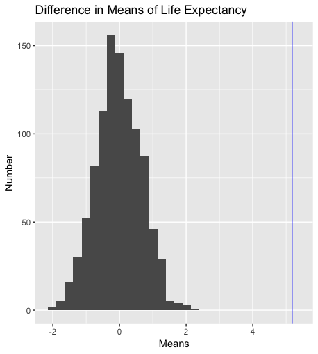

```{r setup, include=FALSE}
knitr::opts_chunk$set(echo = TRUE)
```

#Two-Sample Permutation Test

__Question:__ How does the average life expectancy for the American countries compare to that of other countries around the world?



```{r, eval=FALSE}
library(tidyverse)
library(gapminder)

gapminder <- gapminder
life_expectancy <- gapminder %>% select(lifeExp)
life_expectancy <- life_expectancy$lifeExp


perm_mean <- function(perms = 1000, values, n1)
{
  ## Variables ##
  # perms: The number of permutations 
  # values (num): 
  # n1 (int): Size of group 1
  ###############

  # Create vector of zeroes of length "perms" to store permuted mean differnces
  mean_mat <- matrix(0,1000,1)
  
  # Loop throught number of permutations
  for (i in c(1:perms))
  {
    # Randomly separate vector "values" into disjoint groups of size "n1" and "length(values) - n1" respectively size <- length(values) - n1
    randomSamp <- sample(values, length(values)-n1, replace = FALSE)
    randomSamp2 <- sample(values, n1, replace = FALSE)
    
    # Compute the sample means for the two groups from step 2
    mean1 <- mean(randomSamp)
    mean2 <- mean(randomSamp2)
    
    # Compute the difference in sample means, store the value in the vector from step 1
    mean_mat[[i]] <- (mean1-mean2)
  }
  # Return new updated vector, created in step 1
  return(mean_mat)
}

life_expAm <- gapminder %>% filter(continent=="Americas") %>% select(lifeExp)
means <- as.tibble(perm_mean(values = life_expectancy, n1 = 300))
summary(life_expAm)
summary(life_expectancy)

realDiff <- mean(life_expAm$lifeExp)-mean(life_expectancy)

stdD <- sqrt((sd(life_expAm$lifeExp))^2/length(life_expAm$lifeExp) + (sd(life_expectancy))^2/length(life_expectancy))
zScore <- realDiff/stdD
zScore
ggplot(means, aes(x=V1 ))+geom_histogram()+
  xlab("Means")+
  geom_vline(xintercept = realDiff, color = "blue", size = .3)+
  ylab("Number")+
  ggtitle("Difference in Means of Life Expectancy")
```

This graph illustrates a normal distribution of differences in mean life expectancies from random samples, where the normal distribution is centered at zero. This shows that when taking random samples of life expectancies, the difference in all the life expectancies averages out to zero, which we would expect. Then, after calculating for the mean life expectancy of countries in North and South America, that was plotted with the blue line, demonstrating that the mean life expectancy in American countries is significantly higher than that of all countries.


question this answers is: is there a correlation between the GDP per Capita and life expectency. 
```{r, eval=FALSE}

library(tidyverse)
library(gapminder)

gapminder <- gapminder

gdp_percap <- gapminder%>%
  select(gdpPercap)

life_exp <- gapminder %>%
  select(lifeExp)

life_exp <- life_exp$lifeExp
gdp_percap <- gdp_percap$gdpPercap

perm_cor <- function(perms = 1000, x, y)
{
  ## Variables ##
  # perms: The number of permutations 
  # x: Vector 1 - for computing correlation
  # y: Vector 2 - for computing correlation
  ###############
  
  corr_mat <- matrix(0,1000,1)
  # Step 1:
  # Create vector of zeroes of length "perms" to store
  # permuted mean differnces
  
  # Loop throught number of permutations
  for (i in c(1:perms))
  {
    rsamp <- sample(y, length(y), replace = FALSE)
    
    # Step 2:
    # Randomly mix up the values in the vector "y"
    
    corr_mat[[i]] = cor(x,rsamp)
    # Step 3:
    # Compute the correlation between x and the randomly mixed
    # up y-vector. Store this value in the vector from step 1.
    
  }
  
  # Step 4:
  # Return new updated vector, created in step 1
  return(corr_mat)
}

correlation <- as.tibble(perm_cor(x=gdp_percap,y=life_exp))

ggplot(correlation, aes(x=V1))+geom_histogram()
```

The plot shows a normal distribution of data when tested over 100 random samples. The mean of the sample data is centered around zero which would imply that the two factors are uncorrelated. This being said, some generated samples show a weak positive and a weak negative linear correlation. 


question: is there a correlation between the GDP per Capita and life expectency? 
```{r, eval=FASLE}


```{r setup, include=FALSE}


library(tidyverse)
library(gapminder)

gapminder <- gapminder

gdp_percap <- gapminder%>%
  select(gdpPercap)

life_exp <- gapminder %>%
  select(lifeExp)

life_exp <- life_exp$lifeExp
gdp_percap <- gdp_percap$gdpPercap

real_cor <- cor(gdp_percap,life_exp)

perm_cor <- function(perms = 1000, x, y)
{
  ## Variables ##
  # perms: The number of permutations 
  # x: Vector 1 - for computing correlation
  # y: Vector 2 - for computing correlation
  ###############
  
  corr_mat <- matrix(0,length(perms),1)
  mylist <- rep(list(0,1000))
  # Step 1:
  # Create vector of zeroes of length "perms" to store
  # permuted mean differnces
  
  # Loop throught number of permutations
  for (i in c(1:perms))
  {
    mylist[[i]] <- sample(y, length(y), replace = FALSE)
    
    # Step 2:
    # Randomly mix up the values in the vector "y"
    
    corr_mat[[i]] = real_cor + cor(x,mylist[[i]])
    # Step 3:
    # Compute the correlation between x and the randomly mixed
    # up y-vector. Store this value in the vector from step 1.
    
  }
  
  # Step 4:
  # Return new updated vector, created in step 1
  return(corr_mat)
}

correlation <- as.tibble(perm_cor(x=life_exp,y=gdp_percap))

props <- as.tibble(quantile(perm_cor(x=gdp_percap,y=life_exp)))

real_cor <- cor(gdp_percap,life_exp)


ggplot(correlation, aes(x=value))+geom_histogram() + labs(x= "correlation", y = "count", title = "correlation between GDP per capita and life expectency")+ geom_vline(xintercept = real_cor, col = "Blue")
```
```
The plot shows a normal distribution of data when tested over 100 random samples. The mean of the sample data is roughly centered around 0.58 which would imply that the two factors are moderately correlated. One standard deviation of the data is roughly 0.024, so the correlation is pretty invariant. A blue vertical line is plotted to show where the actual correlation between the data is (without permutation tests). Since our permutation tests are done 1000 times, the central limit theorem holds on our data being approximated by a normal distribution as yields accurate data for the calculated correlation between life expectency and GDP per capita. The median data statistic for the permutation test is 0.5857 and the 1st quadrant begins at 0.5695 while the third quadrant begins as 0.6014, so since the actual correlation lies within this data, we would reject the null hypothesis which says that the correlation of the data is zero. 

# When will it end

question this answers is: is there a correlation between the GDP per Capita and life expectency. 
```{r, eval=FASLE}


```{r setup, include=FALSE}


library(tidyverse)
library(gapminder)

gapminder <- gapminder

gdp_percap <- gapminder%>%
  select(gdpPercap)

life_exp <- gapminder %>%
  select(lifeExp)

life_exp <- life_exp$lifeExp
gdp_percap <- gdp_percap$gdpPercap

perm_cor <- function(perms = 1000, x, y)
{
  ## Variables ##
  # perms: The number of permutations 
  # x: Vector 1 - for computing correlation
  # y: Vector 2 - for computing correlation
  ###############
  
  corr_mat <- matrix(0,1000,1)
  # Step 1:
  # Create vector of zeroes of length "perms" to store
  # permuted mean differnces
  
  # Loop throught number of permutations
  for (i in c(1:perms))
  {
    rsamp <- sample(y, length(y), replace = FALSE)
    
    # Step 2:
    # Randomly mix up the values in the vector "y"
    
    corr_mat[[i]] = cor(x,rsamp)
    # Step 3:
    # Compute the correlation between x and the randomly mixed
    # up y-vector. Store this value in the vector from step 1.
    
  }
  
  # Step 4:
  # Return new updated vector, created in step 1
  return(corr_mat)
}

correlation <- as.tibble(perm_cor(x=gdp_percap,y=life_exp))

ggplot(correlation, aes(x=V1))+geom_histogram()
```
```
The plot shows a normal distribution of data when tested over 100 random samples. The mean of the sample data is centered around zero which would imply that the two factors are uncorrelated. This being said, some generated samples show a weak positive and a weak negative linear correlation. 

# When will it end
>>>>>>> master
=======