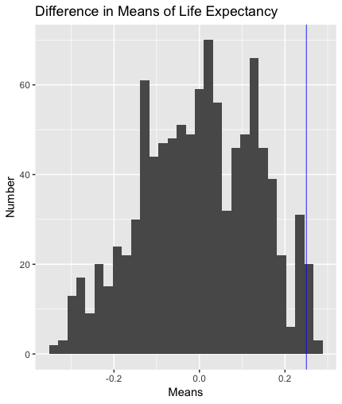
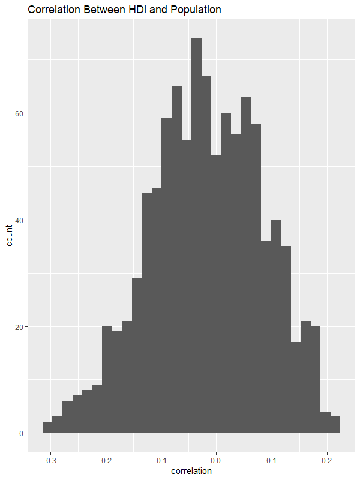
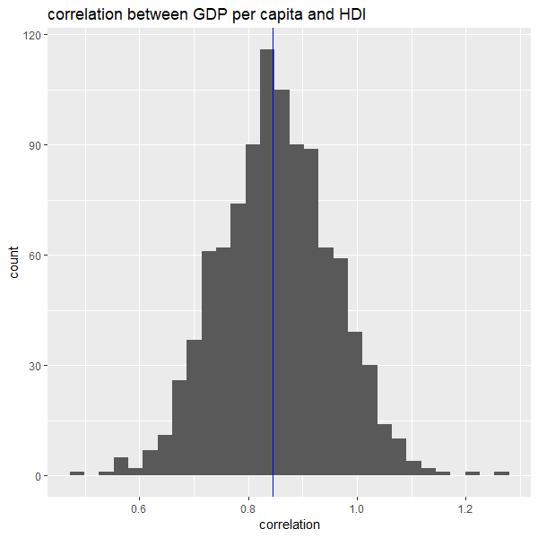
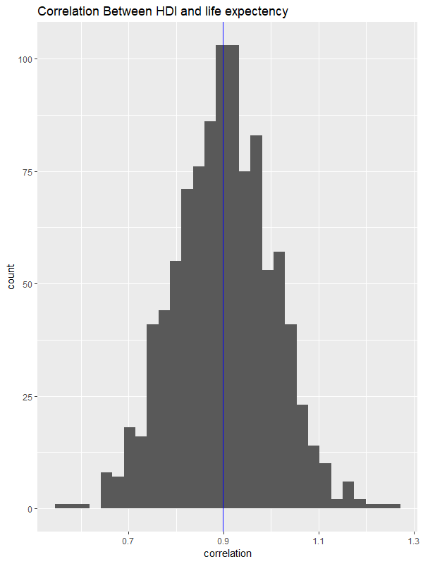

```{r setup, include=FALSE}
knitr::opts_chunk$set(echo = TRUE)
```


# Is North America More Developed than the Rest of the World?

This question is important because we want to see what factors, if any, correlate to a place being more developed. If one region of the world is significantly more developed than the rest of the world, this information can be crucial in determining how we can implement policies to progress the rest of the world. Therefore, it is also important and interesting to look at specific factors that could affect the development of a country, and compare them across countries, as well as with other factors to see which ones have the most correlation with development.

```{r, eval=FALSE}
library(tidyverse)
library(gapminder)
gapminder <- gapminder

#Run this code to get the new data
library(readxl)
Indicator_HDI <- read_excel("Indicator_HDI.xlsx")

Indicator_HDI2 <- Indicator_HDI%>%
  na.omit()

Indicator_HDI3 <- gather(Indicator_HDI2, key="year", values=
         `1980`,`1990`,`2000`,`2005`,`2006`,`2007`,`2008`,`2009`,`2011`)

names(Indicator_HDI3) <- c("country", "year", "HDI")

Indicator_HDI3 <- transform(Indicator_HDI3, year=as.numeric(year))

gapminder2 <- full_join(Indicator_HDI3, gapminder, by= c("country", "year"))

gapminder3 <- gapminder2%>%
  na.omit()
view(gapminder3)

#This entire dataset only has the year 2007 as it was the only year both gapminder and the hdi were recorded. We will all compare two continent groupings (e.g. Asia and America) to see if there is a significant difference between the histogram and the true data.

```
Using HDI as a measure for development, we are attempting to find an answer to whether or not The United States and Canada are more developed than the rest of the world. James, Chris, and Anna's sections attempt to show correlation between HDI and Population, GDP Per Capita, Life Expectancy. Amanda's section compares the mean HDI of the United States and Canada to the mean HDI for the world to see if there is a significant difference between the two. 

__Conclusion:__ From all of our findings, it is clear that North America, specifically the United States and Canada, is more developed than the rest of the world. Overall, the United States and Canada combined have a mean Human Development Index that is significantly larger than that of the rest of the world, indicating that they are more developed in the areas related to life expectancy, per capita income, and education. We also tested a possible confounding variable for HDI: population size, and we discovered that this has no significant correlation to the HDI for a country, indicating that this will not skew our results. Finally, we established a basis for a few significant contributing factors towards HDI-- namely Life Expectancy and GDP per Capita. This allowed us to superficially answer the question: why are some countries less developed than the United States and Canada.


## Amanda

__Question:__ Is there a significant difference between the mean Human Development Index in American countries versus the mean HDI for the world?

This question is important because when talking about the development of countries around the world, the Human Development Index accounts for education systems, life expectancy, and per capita income. These are measures that can determine how developed a place is. For example, better education, higher life expectancies, and higher per capita incomes indicate a country with more developed economies and health systems. Since we are trying to see if the United States and Canada are more developed than the rest of the world, generally speaking, comparing the mean HDIs for these two countries to the rest of the world is a strong indicator of how developed they are compared to the rest of the world.



```{r, eval=FALSE}
library(tidyverse)
library(gapminder)
hdi <- gapminder3 %>% select(HDI)
hdi <- hdi$HDI

perm_mean <- function(perms = 1000, values, n1)
{
  p<-vector("double",1000)

  for (i in c(1:perms))
  {
    
    randomSamp<-sample(length(values),n1)
    randomSamp2<-vector('integer',length(values))
    g1<-values[randomSamp]
    for(j in seq(1:length(values))) 
    { 
      if (is.element(j,randomSamp)==FALSE) randomSamp2[j]<-j 
    }
  
    tf<-randomSamp2>0
    randomSamp2<-randomSamp2[tf]
    g2<-values[randomSamp2]
    
    g1_m<-mean(g1)
    g2_m<-mean(g2)
   
    d<- g1_m - g2_m
    p[i]<-d
  }
  return(p)
}
hdiAmerica <- gapminder3 %>% filter(country=="Canada" | country=="United States") %>% select(HDI)

means <- as.tibble(perm_mean(values = hdi, n1 = 2))
summary(hdiAmerica)
summary(hdi)

realDiff <- mean(hdiAmerica$HDI)-mean(hdi)

map_dbl(means, mean)

stdD <- sqrt((sd(hdiAmerica$HDI))^2/length(hdiAmerica$HDI) + (sd(hdi))^2/length(hdi))
zScore <- realDiff/stdD
zScore
# zScore = 12.67035
ggplot(means, aes(x=value ))+geom_histogram()+
  xlab("Means")+
  geom_vline(xintercept = realDiff, color = "blue", size = .3)+
  ylab("Number")+
  ggtitle("Difference in Means of Life Expectancy")
```

This graph depicts a pretty normal distribution of mean differences in HDIs between randomly selected countries around the world, indicating that there is no significant difference between means of HDIs when places are randomly chosen to be compared. The blue line on the graph indicates the mean difference in HDI from United States and Canada compared to the rest of the world. Because This line is about 12.67 standard deviations away from zero (where the normal distribution is centered), it appears that there is a significant difference between the HDI for the United States and Canada versus the rest of the world. The HDI tends to be higher in United States and Canada compared to the rest of the world.

## James
__Question:__ Is there a correlation between HDI and Population? 
 
This question is important as HDI should not be influenced by Population in any way. Countries with higher or lower populations should not be thought of as less or more developed because development has little to do with population size. I chose to use a two-sample correlation test to prove that there is no correlation. 
```{r, eval=FALSE} 
hdi <- gapminder3%>% 
  select(HDI) 
 
pop <- gapminder3%>% 
  select(pop) 
 
pop <- pop$pop 
hdi <- hdi$HDI 
 
real_corpop <- cor(hdi,pop) 
 
perm_cor <- function(perms = 1000, x, y) 
{ 
  corr_mat <- matrix(0,length(perms),1) 
  mylist <- rep(list(0,1000)) 
   
  for (i in c(1:perms)) 
  { 
    mylist[[i]] <- sample(y, length(y), replace = FALSE) 
    corr_mat[[i]] = real_cor + cor(x,mylist[[i]]) 
  } 
  return(corr_mat) 
   
} 
 
hdipop<-perm_cor(x=hdi, y=pop) 
 
map_dbl(hdipop2, median) 
 
hdipop2 <- as.tibble(hdipop) 
 
props <- as.tibble(quantile(hdipop)) 
 
standard_dev <- sd(hdipop) 
 
summary(hdipop2) 
 
ggplot(hdipop2, aes(x=value))+ 
  geom_histogram()+ 
  labs(x= "correlation", y = "count", title = "Correlation Between HDI and Population")+ 
  geom_vline(xintercept = real_corpop, col = "Blue") 
``` 

 
This graph shows that the real correlation and the correlations from random samplings were both around 0. While the result is not statistically significant (i.e. both values are around the same), both values are around 0, which means that there is likely no (or a zero) correlation between HDI and Population.

__Table of Values__

Summary |Value   
--------|--------
 Min.   |-0.30999  
 1st Qu.|-0.08884  
 Median |-0.01661  
 Mean   |-0.01756  
 3rd Qu.| 0.05666  
 Max.   | 0.21164  
 
__Actuall Correlation:-0.02143__

## Chris

__Question:__ Is there a correlation between HDI and GDP Per Capita?

This question is important since HDI should be heavily influenced by GDP per Capita as higher GDP per capita directly implies a more developed country where their populations are better off. In this way, we need to prove that there is a positive correlation between HDI and GDP per capita. I chose to use a two-sample correlation test to prove that there is a positive correlation.
```{r, eval=FALSE}
hdi <- gapminder3%>%
  select(HDI)

gdp<- gapminder3%>%
  select(gdpPercap)

gdp <- life_exp$gdpPercap
hdi <- hdi$HDI

real_cor <- cor(hdi,gdp)

perm_cor <- function(perms = 1000, x, y)
{
  corr_mat <- matrix(0,length(perms),1)
  mylist <- rep(list(0,1000))
  
  for (i in c(1:perms))
  {
    mylist[[i]] <- sample(y, length(y), replace = FALSE)
    corr_mat[[i]] = real_cor + cor(x,mylist[[i]])
  }
  return(corr_mat)
  
}

hdigdp <- as.tibble(perm_cor(x=hdi, y=gdp))

map_dbl(hdigdp, median)


props <- as.tibble(quantile(hdigdp$value))

standard_dev <- sd(hdigdp$value)

summary(hdigdp)

ggplot(hdigdp, aes(x=value))+geom_histogram() + labs(x= "correlation", y = "count", title = "correlation between GDP per capita and HDI")+ geom_vline(xintercept = real_cor, col = "Blue")
```



This graph shows that the real correlation and the correlations from random samplings were both around 0.845. Both the real correlation and the sample from hypothesis testing values are around 0.85, which means that there is likely a large correlation between HDI and GDP per capita. The hypothesis testing verifies this large positive correlation.


__Table of Values__

Summary |Value
--------|--------
 Min.   |0.4916  
 1st Qu.|0.7818  
 Median |0.8505  
 Mean   |0.8516  
 3rd Qu.|0.9189  
 Max.   |1.2731
 
 
 __Actuall Correlation: 0.8454__
 
## Anna

__Question:__ Is there a correlation between HDI and Life Expectancy?

This question is important because higher life expectancy is thought to be indicative of more development in a country. In this way, we need to prove that there is a positive correlation between HDI and Life Expectancy. I chose to use a two-sample correlation test to prove that there is a positive correlation.

```{r, eval=FALSE}
hdi <- gapminder3%>%
  select(HDI)

life_exp <- gapminder3%>%
  select(lifeExp)

life_exp <- life_exp$lifeExp
hdi <- hdi$HDI

real_cor <- cor(hdi,life_exp)

perm_cor <- function(perms = 1000, x, y)
{
  corr_mat <- matrix(0,length(perms),1)
  mylist <- rep(list(0,1000))
  
  for (i in c(1:perms))
  {
    mylist[[i]] <- sample(y, length(y), replace = FALSE)
    corr_mat[[i]] = real_cor + cor(x,mylist[[i]])
  }
  return(corr_mat)
  
}

hdilife<-perm_cor(x=hdi, y=life_exp)

map_dbl(hdilife2, median)

hdilife2 <- as.tibble(hdilife)

props <- as.tibble(quantile(hdilife))

standard_dev <- sd(hdilife)

summary(hdilife2)

ggplot(hdilife2, aes(x=value))+
  geom_histogram()+
  labs(x= "correlation", y = "count", title = "Correlation Between HDI and life expectency")+
  geom_vline(xintercept = real_cor, col = "Blue")
```



This graph shows that the real correlation and the correlations from random samplings were both around 0.9. While the result is not statistically significant (i.e. both values are around the same), both values are around 0.9, which means that there is likely a large correlation between HDI and Life Expectancy.

__Table of Values__

Summary |Value
--------|--------
 Min.   |0.5633  
 1st Qu.|0.8317  
 Median |0.9024  
 Mean   |0.9008  
 3rd Qu.|0.9677  
 Max.   |1.2657  
 
__Actuall Correlation: 0.89548__