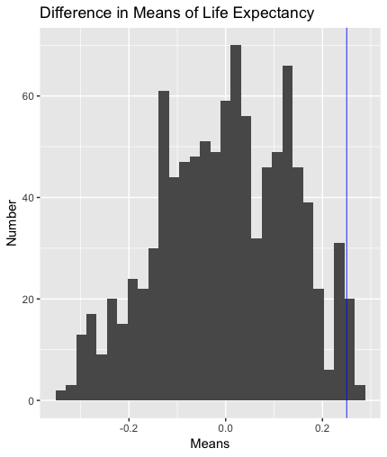

```{r setup, include=FALSE}
knitr::opts_chunk$set(echo = TRUE)
```


# Is North America More Developed than the Rest of the World?
```{r, eval=FALSE}
library(tidyverse)
library(gapminder)
gapminder <- gapminder

#Run this code to get the new data
library(readxl)
Indicator_HDI <- read_excel("Indicator_HDI.xlsx")

Indicator_HDI2 <- Indicator_HDI%>%
  na.omit()

Indicator_HDI3 <- gather(Indicator_HDI2, key="year", values=
         `1980`,`1990`,`2000`,`2005`,`2006`,`2007`,`2008`,`2009`,`2011`)

names(Indicator_HDI3) <- c("country", "year", "HDI")

Indicator_HDI3 <- transform(Indicator_HDI3, year=as.numeric(year))

gapminder2 <- full_join(Indicator_HDI3, gapminder, by= c("country", "year"))

gapminder3 <- gapminder2%>%
  na.omit()
view(gapminder3)

#This entire dataset only has the year 2007 as it was the only year both gapminder and the hdi were recorded. We will all compare two continent groupings (e.g. Asia and America) to see if there is a significant difference between the histogram and the true data.

```
Using HDI as a measure for development, we are attempting to find an answer to whether or not The United States and Canada are more developed than the rest of the world. James, Chris, and Anna's sections attempt to show correlation between HDI and Population, GDP Per Capita, Life Expectancy. 

## Amanda

__Question:__ Is there a significant difference between the mean Human Development Index in American countries versus the mean HDI for the world?

This question is important because when talking about the development of countries around the world, the Human Development Index accounts for education systems, life expectancy, and per capita income. These are measures that can determine how developed a place is. For example, better education, higher life expectancies, and higher per capita incomes indicate a country with more developed economies and health systems. Since we are trying to see if the United States and Canada are more developed than the rest of the world, generally speaking, comparing the mean HDIs for these two countries to the rest of the world is a strong indicator of how developed they are compared to the rest of the world.



```{r, Eval=FALSE}
library(tidyverse)
library(gapminder)
hdi <- gapminder3 %>% select(HDI)
hdi <- hdi$HDI

perm_mean <- function(perms = 1000, values, n1)
{
  p<-vector("double",1000)

  for (i in c(1:perms))
  {
    
    randomSamp<-sample(length(values),n1)
    randomSamp2<-vector('integer',length(values))
    g1<-values[randomSamp]
    for(j in seq(1:length(values))) 
    { 
      if (is.element(j,randomSamp)==FALSE) randomSamp2[j]<-j 
    }
  
    tf<-randomSamp2>0
    randomSamp2<-randomSamp2[tf]
    g2<-values[randomSamp2]
    
    g1_m<-mean(g1)
    g2_m<-mean(g2)
   
    d<- g1_m - g2_m
    p[i]<-d
  }
  return(p)
}
hdiAmerica <- gapminder3 %>% filter(country=="Canada" | country=="United States") %>% select(HDI)

means <- as.tibble(perm_mean(values = hdi, n1 = 2))
summary(hdiAmerica)
summary(hdi)

realDiff <- mean(hdiAmerica$HDI)-mean(hdi)

map_dbl(means, mean)

stdD <- sqrt((sd(hdiAmerica$HDI))^2/length(hdiAmerica$HDI) + (sd(hdi))^2/length(hdi))
zScore <- realDiff/stdD
zScore
# zScore = 12.67035
ggplot(means, aes(x=value ))+geom_histogram()+
  xlab("Means")+
  geom_vline(xintercept = realDiff, color = "blue", size = .3)+
  ylab("Number")+
  ggtitle("Difference in Means of Life Expectancy")
```

This graph depicts a pretty normal distribution of mean differences in HDIs between randomly selected countries around the world, indicating that there is no significant difference between means of HDIs when places are randomly chosen to be compared. The blue line on the graph indicates the mean difference in HDI from United States and Canada compared to the rest of the world. Because This line is about 12.67 standard deviations away from zero (where the normal distribution is centered), it appears that there is a significant difference between the HDI for the United States and Canada versus the rest of the world. The HDI tends to be higher in United States and Canada compared to the rest of the world.

## James

```{r, Eval=FALSE}
library(tidyverse)
library(gapminder)
data<-gapminder

perm_mean <- function(perms, values, n1)
{
  ## Variables ##
  # perms: The number of permutations 
  # values (num): 
  # n1 (int): Size of group 1
  ###############
  
  # Step 1:
  # Create vector of zeroes of length "perms" to store
  # permuted mean differnces
  p<-vector("double",1000)
  
  # Loop throught number of permutations
  for (i in c(1:perms))
  {
    # Step 2:
    # Randomly separate vector "values" into disjoint 
    # groups of size "n1" and "length(values) - n1" respectively
    rows1<-sample(length(values),n1)
    rows2<-vector('integer',length(values))
    g1<-values[rows1]
    for(j in seq(1:length(values))) 
    { 
      if (is.element(j,rows1)==FALSE) rows2[j]<-j 
    }
    #REMOVE ALL 0s WITH TRUE FALSE VECTOR
    tf<-rows2>0
    rows2<-rows2[tf]
    g2<-values[rows2]
    
    # Step 3:
    # Compute the sample means for the two groups from 
    # step 2
    g1_m<-median(g1)
    g2_m<-median(g2)
    # Step 4: 
    # Compute the difference in sample means, store the
    # value in the vector from step 1
    d<- g1_m - g2_m
    p[i]<-d
  }
  
  # Step 5:
  # Return new updated vector, created in step 1
  return(p)
}
f_data<-perm_mean(1000,data$lifeExp,500)
ggplot(data=as.tibble(f_data))+geom_histogram(aes(f_data))

asia<-gapminder%>%
  filter(continent=='Asia',year==1967|year==1997)%>%
  select(continent,country,year,lifeExp)%>%
  group_by(country)%>%
  mutate(diff=abs(lifeExp[[1]]-lifeExp[[2]]))%>%
  ungroup(country)
  
asia_sum<-gapminder%>%
  filter(continent=='Asia',year==1967|year==1997)%>%
  select(continent,country,year,lifeExp)%>%
  group_by(country)%>%
  mutate(diff=abs(lifeExp[[1]]-lifeExp[[2]]))%>%
  ungroup(country)%>%
  summarize(med=median(diff))
view(asia)

med_vec<-vector('double',1000)

perm<-function(country,le67,le97){
  diff<-vector('double',4)
  diff[1]<-0
  diff[2]<-0
  diff[3]<-le67-le97
  diff[4]<-le97-le67
  return(diff)
}
for(i in c(1:1000)){
  asia_diff<-vector('double',33)
  for(j in c(1:33)){
    asia_diff[j]<-sample(perm(asia[2*j,2],asia[2*j-1,4],asia[2*j,4]),1)
  }
  med_vec[[i]]<-median(asia_diff)
}
```

## Chris
```{r, Eval=FALSE}
hdi <- gapminder3%>%
  select(HDI)

gdp<- gapminder3%>%
  select(gdpPercap)

gdp <- life_exp$gdpPercap
hdi <- hdi$HDI

real_cor <- cor(hdi,gdp)

perm_cor <- function(perms = 1000, x, y)
{
  corr_mat <- matrix(0,length(perms),1)
  mylist <- rep(list(0,1000))
  
  for (i in c(1:perms))
  {
    mylist[[i]] <- sample(y, length(y), replace = FALSE)
    corr_mat[[i]] = real_cor + cor(x,mylist[[i]])
  }
  return(corr_mat)
  
}

hdigdp <- as.tibble(perm_cor(x=hdi, y=gdp))

map_dbl(hdigdp, median)


props <- as.tibble(quantile(hdigdp$value))

standard_dev <- sd(hdigdp$value)

summary(hdigdp)

ggplot(hdigdp, aes(x=value))+geom_histogram() + labs(x= "correlation", y = "count", title = "correlation between GDP per capita and HDI")+ geom_vline(xintercept = real_cor, col = "Blue")
```

## Anna

__Question:__ Is there a correlation between HDI and Life Expectancy?

This question is important becausehigher life expectancy is though to be indiciative of more development in a country. In this way, we need to prove that there is a positive correlation between HDIand Life Expectancy. I chose to use a two sample correlation test to prove that there is a positive correlation.

```{r, Eval=FALSE}
hdi <- gapminder3%>%
  select(HDI)

life_exp <- gapminder3%>%
  select(lifeExp)

life_exp <- life_exp$lifeExp
hdi <- hdi$HDI

real_cor <- cor(hdi,life_exp)

perm_cor <- function(perms = 1000, x, y)
{
  corr_mat <- matrix(0,length(perms),1)
  mylist <- rep(list(0,1000))
  
  for (i in c(1:perms))
  {
    mylist[[i]] <- sample(y, length(y), replace = FALSE)
    corr_mat[[i]] = real_cor + cor(x,mylist[[i]])
  }
  return(corr_mat)
  
}

hdilife<-perm_cor(x=hdi, y=life_exp)

map_dbl(hdilife2, median)

hdilife2 <- as.tibble(hdilife)

props <- as.tibble(quantile(hdilife))

standard_dev <- sd(hdilife)

summary(hdilife2)

ggplot(hdilife2, aes(x=value))+
  geom_histogram()+
  labs(x= "correlation", y = "count", title = "Correlation Between HDI and life expectency")+
  geom_vline(xintercept = real_cor, col = "Blue")
```