```{r setup, include=FALSE}
knitr::opts_chunk$set(echo = TRUE)
```

# Lab 3 Redo
```{r, eval=FALSE}
library(tidyverse)
source("http://www.openintro.org/stat/data/cdc.R")
cdc <- as_tibble(cdc)
```
__Overall Question__: What are the differences between different ages and genders in the amount of exercise per month? 

__Why it is important__: There are many generational differences between people. In order to better prepare all generations for a healthier life, we first need to see the differences between different ages' exercise habits. This will help us make recommendations to both parents of children and health care providers to help increase the overall health of all people. We also want to see the differences between genders in terms of exercise habits and health, as different genders have different body types and therefore do not benefit from the same kinds of exercise in the same way. Lastly, identifying the relation between those who want to lose weight and exercise and those who want to lose weight and do not exercise is important, as healthcare providers can help motivate those who want to lose weight and do not exercise to exercise more often (as exercise is liked to weight loss).

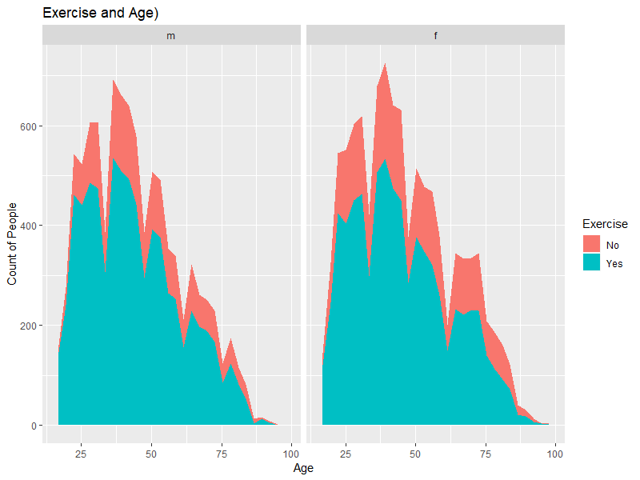

```{r, eval=FALSE}
ggplot(data=cdc,aes(x=age, fill=as.factor(exerany)))+
  geom_area(stat="bin")+
  facet_wrap(~gender)+
  scale_fill_discrete(name= "Exercise", breaks=c("0", "1"), labels=c("No","Yes"))+
  labs(x="Age",y="Count of People",title="Exercise and Age)")
```

In this plot, we can see that for both Males and Females, at around the ages of 25-50 and 60-75, there are large amounts of people who do not exercise at all. This is problematic expecially in older ages as exercise become more important in order to be healthier when older.

We also looked at the percentage of people that wanted to lose weight and exercised versus people that wanted to lose weight and not exercise. These proportions are visualized in the plot below.

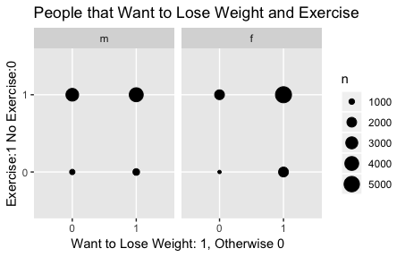

Some interesting probabilities that are associated with this plot are the conditional probabilities of someone going to the gym given that they want to lose weight. For females, this probability is 74%, and for males it is 77%.

We also wanted to calculate the percentage of males and females that try to lose weight by going to the gym. For males, this was 42%, and for females it was 52%. To determine if this difference in percentages was statistically significant, we performed a permutation test.

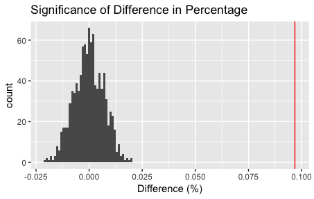

This plot contains our approximate distribution of our permutation test and our observed difference. Clearly, this difference is significant.

We overall recommend that doctors and providers put emphasis on those between the ages of 25 and 75 in order to increase the amount of people who exercise. We also recommend to emphasize excersising as a means to lose weight as there are still a small portiion of people who want to lose weight and do not exercise for whatever reason.

---

## Height, Weight, and Gender(James)

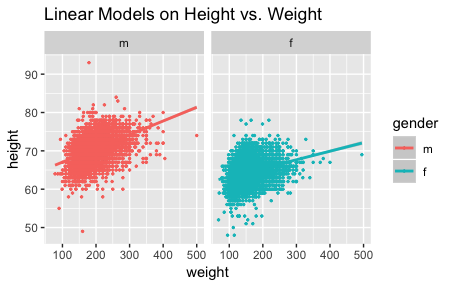

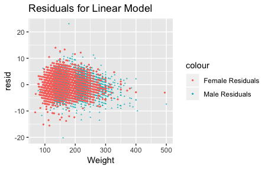

I wanted to look at the variablility of height versus weight for both males and females. For each plot, I also included a linear model. I also plotted the residuals for the linear model, which look fine. 

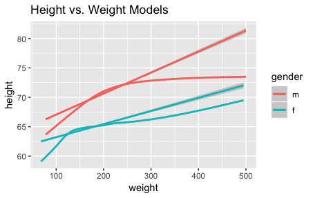

Above is an overlay of the linear model with the geom_smooth function. Some noticeable features are that the height for both men and women tend to approach an asymptote, but the linear model does not account for that. 
One other thing that the linear model does not account for is the how the slope varies. Initially, for both men and women, the slope is steep, but as weight increases, the slope decreases some.  

## Gender and Desired Weight (Amanda)
Is there a significant difference between males and females in the distance to their desired weight?

This is relevant to our overall question because by looking at how far males and females are to their desired weight, we could find some possible correlations to exercise patterns between males and females. The results from this question could help us figure out where any differences in exercise by gender might be coming from. It could also present some information on the psychology behind the male and female brains: does either gender tend to feel unhappier with their weight and does this have a positive or negative correlation with amount of exercise?

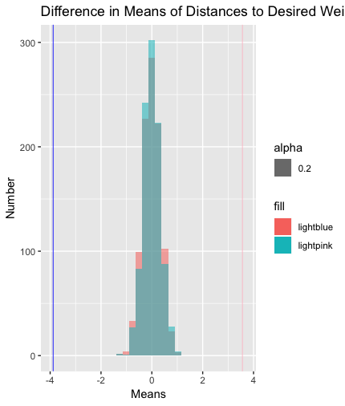 
```{r, eval=FALSE}
library(tidyverse)
library(lubridate)
library(plyr)
library(dplyr)
cdc1 <- cdc %>% mutate(distToDesiredWt = weight - wtdesire)
cdc1$distToDesiredWt <- as.numeric(cdc1$distToDesiredWt)
##view(cdc1)

#Permutation Test
cdcF <- cdc1 %>% filter(gender=="f")
##view(cdcF)
cdcM <- cdc1 %>% filter(gender=="m")
##view(cdcM)

cdc1 <- cdc1$distToDesiredWt
perm_mean <- function(perms = 1000, values, n1)
{
  p<-vector("double",1000)

  for (i in c(1:perms))
  {
    
    randomSamp<-sample(length(values),n1)
    randomSamp2<-vector('integer',length(values))
    g1<-values[randomSamp]
    for(j in seq(1:length(values))) 
    { 
      if (is.element(j,randomSamp)==FALSE) randomSamp2[j]<-j 
    }
  
    tf<-randomSamp2>0
    randomSamp2<-randomSamp2[tf]
    g2<-values[randomSamp2]
    
    g1_m<-mean(g1)
    g2_m<-mean(g2)
   
    d<- g1_m - g2_m
    p[i]<-d
  }
  return(p)
}
meansF <- as_tibble(perm_mean(values = cdc1, n1 = 10431))
meansM <- as_tibble(perm_mean(values = cdc1, n1 = 9569))

summary(cdcM)
summary(cdcF)
summary(cdc1)

realDiffM <- mean(cdcM$distToDesiredWt)-mean(cdc1)
realDiffF <- mean(cdcF$distToDesiredWt)-mean(cdc1)


stdDM <- sqrt((sd(cdcM$distToDesiredWt))^2/length(cdcM$distToDesiredWt) + (sd(cdc1))^2/length(cdc1))
stdDF <- sqrt((sd(cdcF$distToDesiredWt))^2/length(cdcF$distToDesiredWt) + (sd(cdc1))^2/length(cdc1))

zScoreM <- realDiffM/stdDM
zScoreF <- realDiffF/stdDF
zScoreM
zScoreF

# Plots
ggplot()+geom_histogram(data=meansM, aes(x=value, fill = "lightblue", alpha=.2))+ geom_histogram(data=meansF, aes(x=value, fill = "lightpink", alpha = .2))+
  xlab("Means")+
  geom_vline(xintercept = realDiffF, color = "pink", size = .3)+ geom_vline(xintercept=realDiffM, color="blue", size = .3)+
  ylab("Number")+
  ggtitle("Difference in Means of Distances to Desired Weight Based on Gender")

```

To create this graph, I first created a new variable in the dataset that represents how far away each person is to their desired weight. Positive numbers correlate with a person being above their desired weight while negative numbers correlate with a person being below their desired weight. Then, I split by data up based on gender, and did two-sample permutation tests for sample sizes equal to the number of males and number of females to see how the mean distances in desired weights would be expected to be if a random sample was taken from the entire data, which is illustrated by the two normal distributed histograms in the graph. I then calculated what the actual mean distance from desired weight is for each gender and plotted these on the graph, with blue representing males and pink representing females.

From this graph, it is clear that both males and females are at a significant distance away from their desired weight. However, females tend to be way over their desired weight while males tend to be under theirs. 

## Weight and Age (Chris)
Question: How do mean weights vary over age groups? Can we model this with an equation? 
```{r, eval= FALSE}
 ggplot(data = cdc, aes(x = smoke100, y = age , color = gender))+ geom_dotplot(binaxis = "y" , stackdir = "center", binwidth = 1/20) + labs(x ='Do they smoke?', y = 'age', title = 'Age correlation to smoking')

mean_weight <- cdc %>%
  select(age,weight) %>%
  group_by(age) %>%
  summarise(mean_wght = mean(weight))

summary(mean_weight)

mean_weight %>% 
  ggplot(aes(age, mean_wght)) + 
  geom_line() + 
  ggtitle("Full data = ")

age_mod1 <- lm(mean_wght ~ age, data = mean_weight)
age_mod2 <- lm(mean_wght ~ ns(age,2) , data = mean_weight)
age_mod3 <- lm(mean_wght ~ns(age,3), data = mean_weight)

mean_weight %>% 
  add_predictions(age_mod1) %>%
  ggplot(aes(age, pred)) + 
  geom_line() + 
  ggtitle("Linear trend + ")

mean_weight %>% 
  add_predictions(age_mod2) %>%
  ggplot(aes(age, pred)) + 
  geom_line() + 
  ggtitle("Quadratic trend + ")

mean_weight %>% 
  add_predictions(age_mod3) %>%
  ggplot(aes(age, pred)) + 
  geom_line() + 
  ggtitle("Cubic trend + ")

mean_weight %>% 
  add_residuals(age_mod1) %>% 
  ggplot(aes(age, resid)) + 
  geom_hline(yintercept = 0, colour = "white", size = 10) + 
  geom_line() + 
  ggtitle("Remaining pattern of linear model")

mean_weight %>% 
  add_residuals(age_mod2) %>% 
  ggplot(aes(age, resid)) + 
  geom_hline(yintercept = 0, colour = "white", size = 10) + 
  geom_line() + 
  ggtitle("Remaining pattern of quadratic model")

```


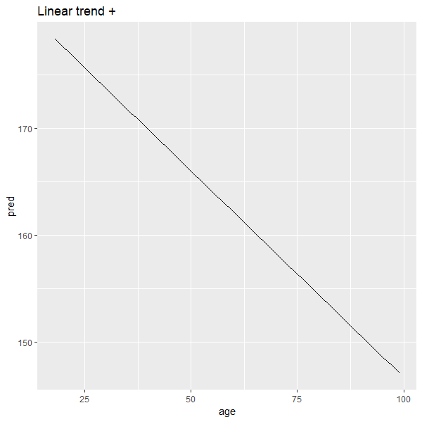

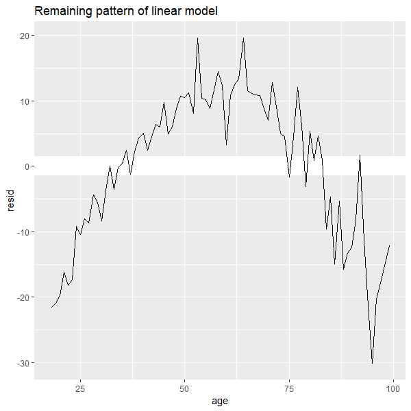

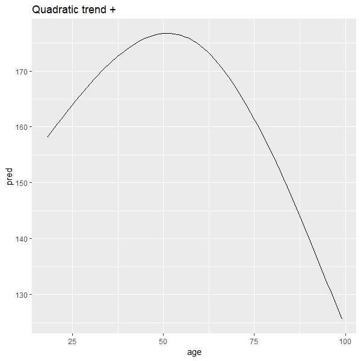

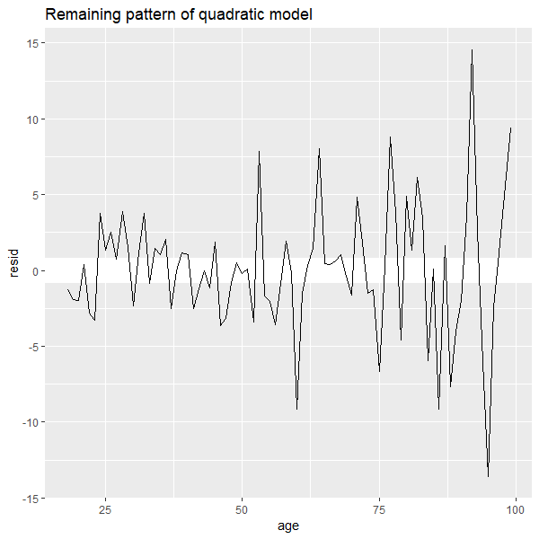

In this analysis, I used the data to try and figure out the general trends between age and weight. These statistics can be used to determine genreal health relationships among age groups: for instance, obesity is a major contributing factor towards heart disease, and being underweight can cause osteoperosis or anemia. If we can show a relationship between ages and weight, we can better target certain groups to make sure they maintain a healthy level of weight. 

I tidied the data to only reflect the age and weight of people in the data set. Then, I grouped by age to find the mean weight of each age group from 18-99. After that, I made two functionss: one that finds a linear model of the tidy data, and one that finds a quadrartic model to fit the data by using predictions from the data. After this, I found the residuals of the respective models. I then plotted both the model and their residuals to determine which was better, as well as the full data without a model. This analysis revealed that the Quadratic model was much more accurate as seen on the residual plot. 

The residual plot of the linear model shows a clear concave-down quadric function that was still present in the data. The residual from the quadratic model showed no clear trend, apart from an increasing periodic trend that is more prominent in older ages. We can hypothesize that this is reflective of noise in the data and in lack of as many data points for older people(50-99) than in younger age groups(18-50). From this, we can see that people in the age group of 40-60 are , on average, the heaviest group, so they should be monitered more closely for diseases that stem from being overweight. 

We can also see that the 65+ age group loses weight rapidly, so they should be monitored for too quick of weight loss as well and should focus on retaining weight to remain healthy. We can use this to warn groups approaching these age categories to be cognizant of their weight and to try and prevent any drastic changes to preserve their health. 

__Table:Values__

Statistic        |Value
-----------------|---------------
      age        |   mean_wght    
 Min.   :18.00   |Min.   :118.5  
 1st Qu.:38.00   |1st Qu.:157.1  
 Median :58.00   |Median :167.7  
 Mean   :58.01   |Mean   :162.9  
 3rd Qu.:78.00   |3rd Qu.:173.3  
 Max.   :99.00   |Max.   :184.5  

## General Health and Health Plan (Anna)
Question: What is the relation between General Health and Health?

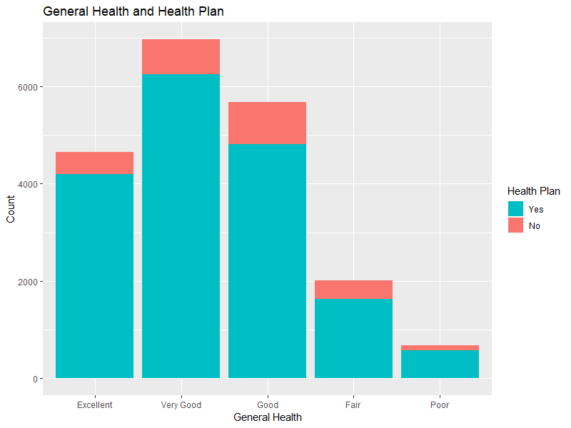 
    
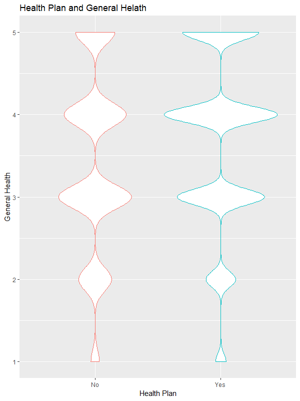

```{r, eval=FALSE}
# Renaming the genhlth column
cdc2 <- cdc%>%
  mutate(genhlth= as.character(cdc$genhlth))

cdc3<- cdc2%>%
  mutate(hlthnum= as.numeric(str_replace_all(genhlth, c("poor"= "1", "fair"= "2", "^good"= "3", "very good"= "4", "excellent"= "5"))))

cdc4<- cdc3%>%
  mutate(genhlthf=as.factor(cdc$genhlth))

cdc4$genhlthf%>%
  fct_relevel("poor", "fair", "good", "very good")%>%
  levels()

# Statistics
## Overall
mean(cdc3$hlthnum)
sd(cdc3$hlthnum)
## Yes Health Plan
cdcno <- cdc3%>%
  filter(hlthplan== "0")
mean(cdcno$hlthnum)
sd(cdcno$hlthnum)

## No Health Plan
cdcyes <- cdc3%>%
  filter(hlthplan== "1")
mean(cdcyes$hlthnum)
sd(cdcyes$hlthnum)

# New Plots
ggplot(data=cdc3, aes(x=as.factor(hlthplan), y=hlthnum))+
  geom_violin()+
  labs(x="Health Plan", y="General Health", title="Health Plan and General Helath")

ggplot(data=cdc4)+
  geom_bar(mapping=aes(x=genhlthf, fill=as.factor(hlthplan)))+
  labs(x="General Health", y="Count", title="General Health and Health Plan")+
  scale_fill_discrete(name="Health Plan", breaks=c("1", "0"), labels=c("Yes", "No"))+
  scale_x_discrete(breaks=c("poor","fair","good","very good","excellent"), 
                   labels=c("Poor", "Fair", "Good", "Very Good", "Excellent"))

```

__Statistics of General Heatlh__

Health Plan|Mean   |SD
-----------|-------|-------
Overall    |3.64565|1.04859
Yes        |3.67813|1.041252
No         |3.42076|1.071586

This question is interesting because one would assume that and individual would have better health when they have a health plan; however this may not be the case. Proving this relation would help provide evidence that having a health plan leads to a healthier life, and would help aid healthcare providers in signing people up for healthcare. Since Obamacare(The Affordable Care Act) is at risk of being repealed, this data is expecailly important as many people in America cannot afford to pay for healthcare, if healthcare does increase general health, support for Obamacare might increase.

I created two graphs to represent this data. The first graph is a bar plot, which shows the overall count of people with each category of general health. The graph is also colored to show if the individual has a health plan or not. The second graph is a violin plot which shows the distribution of of people in each general health category. As you can see from these two graphs, there is a small difference between the general health of those who have and do not have a health plan. Most individuals without a health plan put more "3s" or "Good" as their self-reported general health. 

I also calculated the means and standard deviations for each health plan as well as the overall mean and standard deviation. From these results, I conluded that while having a health plan increased your overall health, it was not by much (0.2 difference in means). Similarly, looking at the first graph, most people have a health plan than do not, so the relation between general health and data could be further explored with more data from individuals who do not have a helath plan. For this data, however, I cannot give a recomendaiton on whether or not general health is related to health plan.

I used the recently learned skill of string detection and factors in order to change the genhelth column to numbers in order to calculate mean and standard deviation. I chose not to try a permutation test as because the two means were relativly close and the varation in data was low (0,1 for one variable and 1:5 for the other), I felt like the permutation test would not provide any futher analysis (i.e. no difference).

## Team Contributions
See individual sections. We all worked on the group part together. 