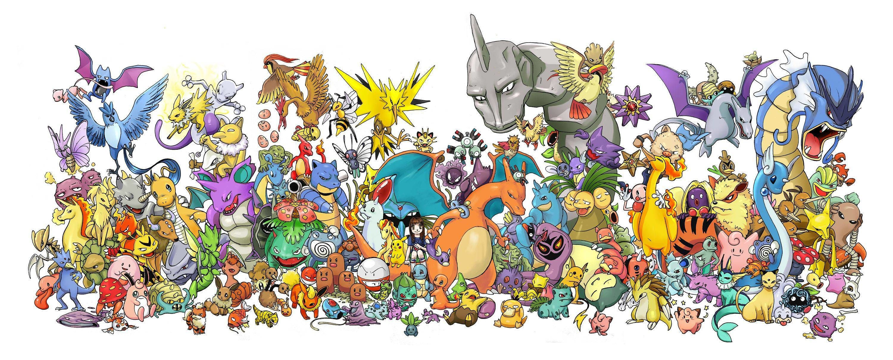
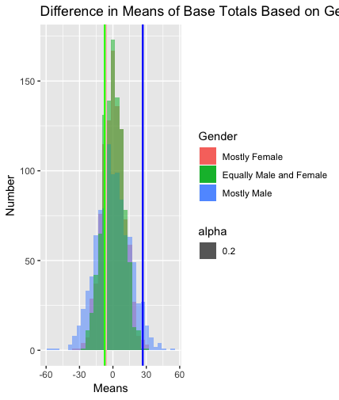
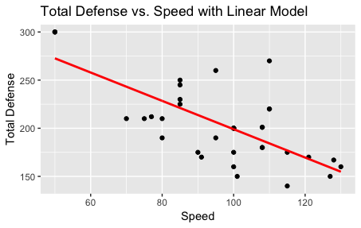
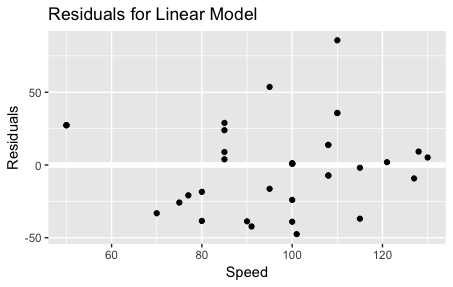
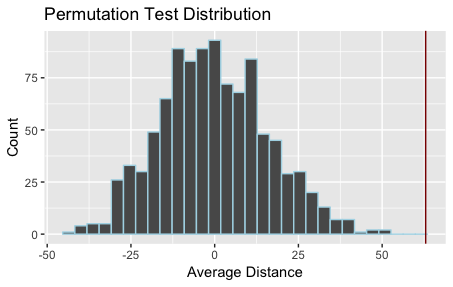
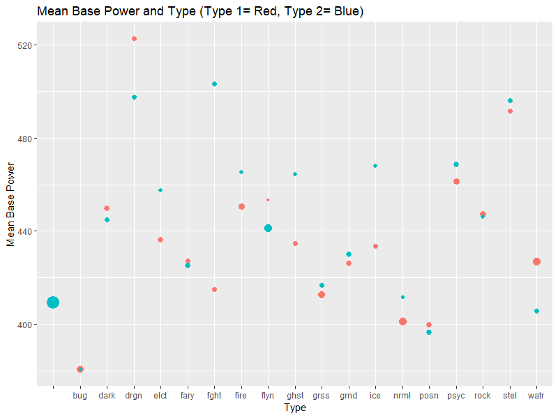

```{r setup, include=FALSE}
knitr::opts_chunk$set(echo = TRUE)
```

```{r, eval=FALSE}
library(tidyverse)
library(dplyr)
library(readxl)

# The Whole Data
pokemon <-read.csv(file= "pokemon.csv")

# Easier to Read Data
pokemonlite <-pokemon%>% #an easier way to look at the data
  select(pokedex_number, name, type1, type2, generation, is_legendary)
```

# I WANT TO BE THE VERY BEST (like no one ever was)


## Main Question and Why this is Important
Pokemon is a beloved franchise by many children and adults alike. As the franchise has grown from one video game in 1996, to now a multimedia monolith (including trading cards, movies, and a tv series), fans have been waiting in anticipation for the next game in the series, which was recently announced as Pokemon: Sword and Pokemon: Shield. Using data from the previous games (Red, Blue, Green, Yellow, Gold, Silver, Crystal, Ruby Sapphire, FireRed, LeafGreen, Emerald, Diamond, Pearl, Platinum, HeartGold, SoulSilver, Black, White, Black2, White2, X, Y, Omega Ruby, Alpha Sapphire, Sun, Moon, Ultra Sun, Ultra Moon, Let's G0 Eevee, Lets Go Pikachu), we wanted to create a list of recommendations to help become the very best (like no one ever was) in Sword and Shield, including which pokemon to bring with us from the previous generations.

## Recommendations
Based off of our individual findings, we each have come up with four statements regarding various pokemon stats on how to be the very best (like no one ever was) in the new game.

1. From the analysis of the best generation and the best pokemon based off of their entry in the Pokedex, I would recommend using either Starters, Pseudo-legendaries, or Legendaries from generation 4 (Sinnoh region) on your team to become the very best.

2. Regarding legendary pokemon to put on your team, it's best to choose the pokemon Latias. If Latias isn't available, it's advised to choose a pokemon that is either a dragon or flying type, with great defensive stats. 

3. Pokemon types that are more likely to be male have significantly better base totals, meaning that in essence, they are superior to the other Pokemon. Therefore, in order to try to be the best player out there, it is recommended that the player puts an emphasis on catching these Pokemon type.

4. Dragon and Steel Types are by far the most powerful on average and the new calculated epwr(an estimate for a pokemon's power based off of the highest attack stat and average Type effectiveness) can help estimate a pokemon's overall attack combat effectiveness. 

## List of References:
https://bulbapedia.bulbagarden.net/wiki/Base_stats

https://bulbapedia.bulbagarden.net/wiki/Catch_rate

https://bulbapedia.bulbagarden.net/wiki/Friendship

https://bulbapedia.bulbagarden.net/wiki/Damage

---

# Amanda
Is there a significant difference between base totals of pokemon types that tend to be mostly female versus types that tend to be mostly male versus types that have a 50/50 chance of being either gender?

This question is important in determining how to be the most successful in the game of Pokemon because when catching a Pokemon, a player would want Pokemon with a higher base total, because this means that it overall is better in defense, attack, speed, and other important components to how good of a character it is. Therefore, I want to see if there is a relationship between the likely gender of the Pokemon and how good of a Pokemon it tends to be. This question is also interesting in general in seeing if there is a significant difference in the base totals between genders because this would exemplify that all Pokemon are not created equal.

 

```{r, eval=FALSE}
pokemon1 <- pokemon %>% select(name, pokedex_number, percentage_male, capture_rate, base_total, base_happiness) %>% mutate(gender =ifelse(percentage_male > 50, "M", ifelse(percentage_male < 50, "F", ifelse(percentage_male==50, "B", ifelse(percentage_male == NA, "N"))))) %>% na.omit

#Permutation Test
pokemonF <- pokemon1 %>% filter(gender=="F")

pokemonM <- pokemon1 %>% filter(gender=="M")

pokemonB <- pokemon1 %>% filter(gender=="B")


pokemon1 <- pokemon1$base_total
perm_mean <- function(perms = 1000, values, n1)
{
  p<-vector("double",1000)

  for (i in c(1:perms))
  {
    
    randomSamp<-sample(length(values),n1)
    randomSamp2<-vector('integer',length(values))
    g1<-values[randomSamp]
    for(j in seq(1:length(values))) 
    { 
      if (is.element(j,randomSamp)==FALSE) randomSamp2[j]<-j 
    }
  
    tf<-randomSamp2>0
    randomSamp2<-randomSamp2[tf]
    g2<-values[randomSamp2]
    
    g1_m<-mean(g1)
    g2_m<-mean(g2)
   
    d<- g1_m - g2_m
    p[i]<-d
  }
  return(p)
}
meansF <- as_tibble(perm_mean(values = pokemon1, n1 = 53))
meansM <- as_tibble(perm_mean(values = pokemon1, n1 = 149))
meansB <- as_tibble(perm_mean(values = pokemon1, n1=501))

summary(pokemonM)
summary(pokemonF)
summary(pokemonB)
summary(pokemon1)

realDiffM <- mean(pokemonM$base_total)-mean(pokemon1)
realDiffF <- mean(pokemonF$base_total)-mean(pokemon1)
realDiffB <- mean(pokemonB$base_total)-mean(pokemon1)


stdDM <- sqrt((sd(pokemonM$base_total))^2/length(pokemonM$base_total) + (sd(pokemon1))^2/length(pokemon1))
stdDF <- sqrt((sd(pokemonF$base_total))^2/length(pokemonF$base_total) + (sd(pokemon1))^2/length(pokemon1))
stdDB <- sqrt((sd(pokemonB$base_total))^2/length(pokemonB$base_total) + (sd(pokemon1))^2/length(pokemon1))

zScoreM <- realDiffM/stdDM
zScoreF <- realDiffF/stdDF
zScoreB <- realDiffB/stdDB
#zScoreM = 2.7992
#zScoreF = -.37173
#zScoreB = -1.1745

# Plots
ggplot()+geom_histogram(data=meansM, aes(x=value, fill = "lightblue", alpha=.2))+ geom_histogram(data=meansF, aes(x=value, fill = "lightpink", alpha = .2)) + geom_histogram(data=meansB, aes(x=value, fill= "lightgreen", alpha=.2)) +
  xlab("Means")+
  geom_vline(xintercept = realDiffF, color = "pink", size = .8)+ geom_vline(xintercept=realDiffM, color="blue", size = .8)+ geom_vline(xintercept=realDiffB, color= "green", size= .8)+
  ylab("Number")+
  ggtitle("Difference in Means of Base Totals Based on Gender of Pokemon") + scale_fill_discrete(name = "Gender", labels = c("Mostly Female", "Equally Male and Female", "Mostly Male"))

```

To create this graph, I first filtered my data to make it easier to read and analyze, only keeping the columns that I would be using for the analysis of Pokemon. In my process, I was looking at how mean base totals compare based on the likely gender of Pokemon. The higher the base total, the better the Pokemon. Then, I split the data up based on gender and did two-sample permutation tests for sample sizes equal to the number of mostly male Pokemon, number of mostly female Pokemon, and number of Pokemon who have a 50/50 chance of being each gender. This was done in order to see how far from average the mean base totals would be expected to be if a random sample were taken from the entire data, which is illustrated by the three normal-distributed histograms in the graph. I then calculated what the actual average distance in mean base total was for each gender and plotted these on the graph, with blue representing mostly males, pink representing mostly females, and green representing Pokemon that have a 50/50 chance of being born as either gender.

From this graph, we can see that both mostly female Pokemon and Pokemon with an equal chance of being each gender have slightly smaller base totals than what would be expected if there were no correlation between gender and base total. However, for these two categories of Pokemon, their z-scores were -0.371 and -1.175, respectively. Since these are both less than two standard deviations away from the mean, these differences are most likely not statistically significant; therefore, we cannot say that these two categories of Pokemon would tend to be less than average. Therefore, in playing the game, a player should not be deterred from catching these kinds of Pokemon because they are not likely to be worse. On the other hand, Pokemon that are mostly male tend to have base totals that are higher than would be expected if there were no correlation between gender and base total. For the mostly male Pokemon, their z-score 2.799, meaning that there is a significant difference in the base totals of the mostly male Pokemon versus the rest of the Pokemon in the game. From this conclusion, if a player were to play the game, it is recommended that they would put more effort and value into catching Pokemon that tend to be male, because this will more likely end up in them having better Pokemon, thus being the best player possible.

#Chris
My main question was which generation had the strongest pokemon overall and is there a trend with Pokedex number and total power?

```{r, eval=FALSE}
BestGen <- pokemon%>%
  select(pokedex_number, name, hp, attack, defense, speed, sp_attack, sp_defense, base_total, generation)%>%
  group_by(generation) %>%
  summarise(mean_stats = mean(base_total))

# pokemon number vs base stats (later entry in pokedex means better stats?)
Pokedex <- pokemon %>%
  select(pokedex_number,base_total,generation,type1)

pokedex_model1 <- lm(base_total ~ pokedex_number, data = Pokedex)
pokedex_model10 <- lm(base_total ~ ns(pokedex_number, 10), data = Pokedex)
pokedex_model800 <- lm(base_total ~ ns(pokedex_number, 800), data = Pokedex)

Pokedex %>% 
  ggplot(aes(pokedex_number, base_total)) + 
  geom_line(aes(color = as.factor(generation))) + 
  ggtitle("Full data") +
  facet_wrap(~generation)

Pokedex %>% 
  add_predictions(pokedex_model1) %>%
  ggplot(aes(pokedex_number, pred)) + 
  geom_line() + 
  ggtitle("Linear trend")

Pokedex %>% 
  add_residuals(pokedex_model1) %>% 
  ggplot(aes(pokedex_number, resid)) + 
  geom_hline(yintercept = 0, colour = "white", size = 10) + 
  geom_point() + 
  ggtitle("Remaining pattern of linear model")

Pokedex %>% 
  add_predictions(pokedex_model10) %>%
  ggplot(aes(pokedex_number, pred)) + 
  geom_line() + 
  ggtitle("10th Degree Polynomial model")

Pokedex %>% 
  add_residuals(pokedex_model10) %>% 
  ggplot(aes(pokedex_number, resid)) + 
  geom_hline(yintercept = 0, colour = "white", size = 10) + 
  geom_point() + 
  ggtitle("Remaining pattern of 10th degree polynomial")


Pokedex %>% 
  add_predictions(pokedex_model800) %>%
  ggplot(aes(pokedex_number, pred)) + 
  geom_line() + 
  ggtitle("800th Degree Polynomial model")

Pokedex %>% 
  add_residuals(pokedex_model800) %>% 
  ggplot(aes(pokedex_number, resid)) + 
  geom_hline(yintercept = 0, colour = "white", size = 10) + 
  geom_point() + 
  ggtitle("Remaining pattern of 800th degree polynomial")
```

Generation | Average Base Total
-----------|--------------------
1          |416.2517
2          |413.1800
3          |420.0222
4          |451.1776
5          |427.0385
6          |437.6111
7          |448.1625

Here we can see that, overall, the mean base stats for generations as a whole conclude that generation 4 possesses the strongest pokemon (in terms of overall stats). The generation with the overall weakest pokemon is generation 2. From the model fitting, we see that a linear model shows an increase in power from the pokemon at the start of the Pokedex to those at the end, but when we look at the entire data, we see spikes at the beginning of the Pokedex for each generation and the end of the Pokedex for each generation. This means a linear model is not sufficient since it won't pick up these trends. 

For this reason, we also showed a 10th-degree polynomial to fit the data. The model more accurately reflects the nature of the pokemon rank in the Pokedex; however, when we look at the residuals for this model, we see large residuals. For this reason, we created an (impractical) 800th-degree polynomial to model the Pokedex. When we did this, we see the residuals are very small and don't have much of a trend at all, so we know our model accurately reflects the Pokedex and the stats of those pokemon. 

From this analysis, we know that the pokemon at the beginning and end of the Pokedex for each generation are the strongest. This would correlate to the starters and the legendaries of each generation. Overall, the legendary pokemon are stronger than the starters because, after all, they are legendary. With this analysis combined, we see that if you seek to be the very best trainer, you will want to have a team of starter and legendary pokemon from any generation, and if possible from generation 4.

If you seek to maximize stats, you will want a team of ALL legendary pokemon from generation 4, but based off of competitive pokemon rules, they ban legendaries, so solely based on max stats of a pokemon, you will want to use starters from generation four in their final evolutions (Torterra, Infernape, and Empoleon). 

If allowed to use legendaries, the data would recommend using legendaries such as Dialga, Palkia or Giratina. The data also conveys that pokemon closer to the end of the Pokedex, but not the very end, are also have higher base stats. This is due to the fact that, in the game, pokemon that fill the end of the Pokedex are encountered at the victory road right before challenging the elite four and pokemon champion, so naturally, these will be better pokemon. 

If you are still sticking with generation four being the strongest, these will be pokemon such as Garchomp and Metagross-- namely pseudo-legendary pokemon for their extremely high stats, but for being naturally occurring pokemon and not associated with mythical origins. 

#James
My analysis will be based on the question: What is the best past generation legendary pokemon to have at your side? 

There are many different ways and arguments that can be made for the best pokemon, but I will mostly be looking at which pokemon gives you the best chance at survival. The first thing that I believe is important is ruling out pokemon that have no base happiness. One shouldn't want a pokemon that doesn't care about them by their side. 

With that said, I limited my selection to pokemon with base happiness greater than 0. Now to survive this hypothetical battle, there are several categories that I will mainly focus on. They are defense, special defense, hp, and speed. Also, legendaries that are a flying or dragon type are considered important. In terms of prioritization, defense and special defense will be the most important, speed and whether they can fly are second, and hp will be the least prioritized. The reasoning behind this ranking is that one should want a legendary that can defend you and themselves against anything and one that can escape at will. The metric of this arbitrary prioritization will be given by the equation m = (defense + sp_defense) + (2/3)(speed + 100(if fly)) + (1/3)(hp). Under this ranking, the top five legendaries to use are Latias, Latios, Articuno, Regirock, and Regice. 

Name     |Metric
---------|-------
Latias   |443.333
Latios   |393.333
Articuno |385.000
Regirock |360.000
Regice   |360.000

This table is interesting because the first three can fly, but the last two can't, which implies that they have great defensive stats. I decided to look at the total defense versus speed to see if there was any correlation. 



As one can see, there is a strong negative correlation between speed and total defense. Below are the residuals for the linear model. 



Having established this linear relationship between defense and speed, I wanted to take a sharper look at the averages for my metric depending on whether the legendaries could fly. What I found was that the average value of the metric was 363 and 300 for pokemon that could and couldn't fly respectfully. To see if the difference of 63 was significant or not, I performed a permutation test. 



As one can see, this difference of 63 between flying and non-flying legendaries is statistically significant. 

#Anna
My main question deals with which pokemon are the strongest in terms of total stats (base_total column) and how to predict if a certain Type (or Types) is likely to have a higher chance of having larget total stats.

```{r, eval=FALSE}
pokemonpwr <- pokemon%>%
  select(pokedex_number, type1, type2, name, hp, attack, defense, speed, sp_attack, sp_defense, base_total,is_legendary)

poketype1 <- pokemonpwr%>%
  group_by(type1)%>%
  summarise(mean= mean(base_total), n=n(), sum=sum(base_total))

poketype2 <- pokemonpwr%>%
  group_by(type2)%>%
  summarise(mean= mean(base_total), n=n(), sum=sum(base_total))

pokeff <- pokemon%>%
  select(name, attack, sp_attack, against_bug, against_dark, against_dragon, against_electric, against_fairy, against_fight, against_fire, against_flying, against_ghost, against_grass, against_ground, against_ice, against_normal, against_poison, against_psychic, against_rock, against_steel, against_water)%>%
  mutate(eff= (against_bug+ against_dark+ against_dragon+ against_electric+ against_fairy+ against_fight+ against_fire+ against_flying+ against_ghost+ against_grass+ against_ground+ against_ice+ against_normal+ against_poison+ against_psychic+ against_rock+ against_steel+ against_water)/(18))

pokeff2 <- pokeff%>%    # I used a recently learned function apply() to pick the highest value in a row
  mutate(attackh= apply(pokeff[,2:22], 1, max))

pokeff3 <- pokeff2%>%
  mutate(epwr= attackh*eff) #Expected Power (for comparison, not acutall calculation)

ggplot()+
  geom_point(poketype1, mapping=aes(x=type1, y=`mean`, size=n, color="Type 1"))+
  geom_point(poketype2, mapping=aes(x=type2, y=`mean`, size=n, color="Type 2"))+
  labs(x= "Type", y= "Mean Base Power", title= "Mean Base Power and Type (Type 1= Red, Type 2= Blue)")+
  theme(legend.position= "none")+
  scale_x_discrete(labels= abbreviate)
  scale_x_discrete(breaks=c("", "bug", "dark", "dragon", "electric", "fairy", "fighting", "fire", "flying", "ghost", "grass", "ground", "ice", "normal", "poison", "psychic", "rock", "steel", "water"))
```


The plot above helps visualize the mean (or average) base power for each type (the names have been shortened). As you can see, the Dragon (drgn) and Steel (stel) Types have the highest mean base power for pokemon with either as their first or second type. We can also see that the worst types on average for base power are Bug (by a large margin) and Poison. 

__The top four pokemon with the highest total stats:__

Name      |Total Stat
----------|----------
Mewtwo    |780
Rayquaza  |780
Kyogre    |760
Groudon   |760

__Top three non-legendary pokemon with the highest total stats:__

Name      |Total Stat
----------|----------
Tyranitar |700
Salamence |700
Metagross |700

__Top three first-type with the highest average total stats:__

Type      |Average Total Stat
----------|-------------------
Dragon    |522.7778
Steel     |491.5833
Psychic   |461.2642

__Top three second-type with the highest average total stats:__

Type      |Average Total Stat
----------|-------------------
Fighting  |522.7778
Dragon    |497.4706
Steel     |495.9545

__Top pokemon for epwr:__

Pokemon   |Epwr
----------|-----------
Heracross |220.9722
Mewtwo    |215.5556
Tyranitar |209.5556
Kyurem    |203.0556
Rayquaza  |202.5000

In pokeff3, I created a new column that multiplied the highest attack value (attack or sp_attack) with an average calculation of the attack multiplier for type. This new value epwr only takes into account attack and type multipliers, but it still is a good base measurement of power vs. any pokemon of any type on average. Higher numbers for this statistic relate to overall attack power as attack is calculated by multiplying both attack/sp_attack (based on what type of move the pokemon uses) and the type modifier. I thought of multiplying the type effectiveness against by the amount of pokemon of that type to get a weighted average but decided since we do not yet know the distribution of new pokemon and their types, it would be better to not (as the ratio might change). 

From this data, we can conclude that one should catch any pokemon that are Dragon and Steel type, regardless if it is the pokemon's first or second type. We can also conclude that legendary pokemon are in fact more powerful than any non-legendary pokemon. Lastly, the new column can help predict how well an older generation pokemon will do in battle, but is not an exact estimate due to other factors (e.g. level, defense, move power). 

---

#Reflections on Lab 2
__Our Team Goal:__ Our goal for the semester is to learn the basics of R programming.

I think we all achieved this goal. I think we also worked very well as a team this semester and were able to get all of the labs completed and to a high caliber. 


## Individual Reflections:

__Amanda:__ My six-month and five-year goals are still pretty much the same as the beginning of the year. I want to celebrate my graduation by traveling out of the country since I never have before, and I have no idea what I want as a career after college but I just hope that I am happy and successful. If I could give myself advice from this year, it would be to use linear models more and be more assertive about talking to professors. I would also tell myself to put myself over others sometimes and take care of myself.

__Chris:__ My six month and five-year goals haven't really changed. I still want to travel after graduation (bc school and the real world are stressful and I know I will need a solid break from both and enjoy the world before I sell my soul to the corporate world) and I still want to be a quant/ investment banker. I learned how to use R to better visualize data and access it more effectively. I actually used my knowledge in my Matrix Methods project and made some cool graphs and overall improved the quality of my report. If I would give myself advice, I'd tell myself to take more personal time so I can actually live my life instead of just working towards a goal. I know of people who are only driven by their educational/career aspirations, and while those are important, there is much more to life than a job. I'd tell myself to keep up the motivation/momentum I have so I can achieve my aspirations. I would tell myself to start learning more programming languages and start working out. I'd also tell myself to start getting things done earlier and stop procrastinating literally everything.

__James:__ I got into graduate school! My five-year goals have stayed the same. In this class, I learned a lot about R and the tidyverse. I found that all the dplyr functions to be VERY useful and now I see the strength of R as a programming language. I have no advice for myself at the beginning of the semester. If I could tell myself something, I would say to keep working hard and don't put so much pressure on yourself.  

__Anna:__ My six-month and 5-year goals have not changed much. I am still a poor college student with at least $10,000 in debt, so I need to pay that off. I learned about r in this class so I can be more competitive for internships. If I could give myself advice, I would tell myself to not take Intro to Probability because I am not doing so well in that class. I would also tell myself to go eat more at the C4C because I found that there is a lot of good food there in the afternoons. I would tell myself to keep hope alive for Animal Crossing, even though there has been no news.