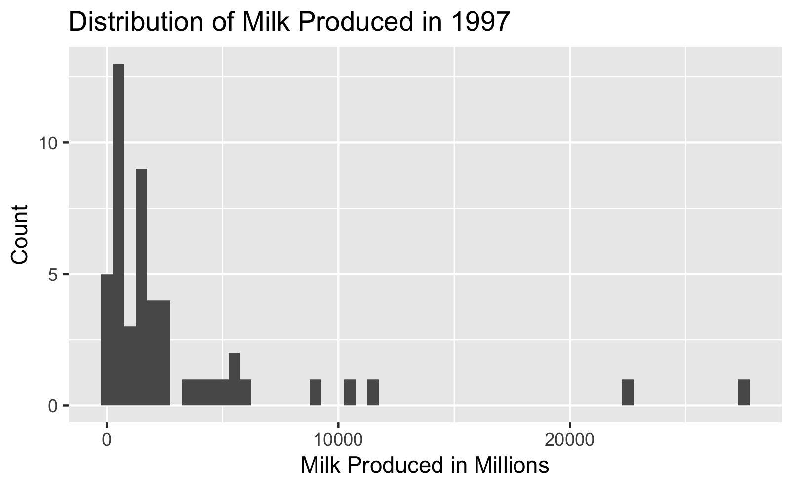
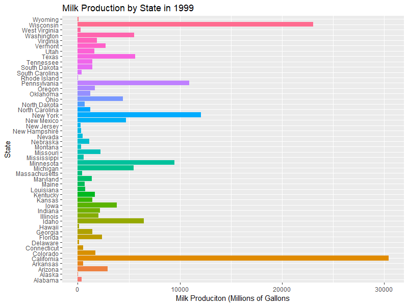

```{r setup, include=FALSE}
knitr::opts_chunk$set(echo = TRUE)

library(tidyverse)

milk <- read.csv('state_milk_production.csv')
milk <- milk %>%
  mutate(milk_million = milk_produced/1000000)
head(milk)
```
# MILK IS GOOD EVEN THOUGH WE BECOME LACTOSE INTOLERANT OVER TIME
The year when the most milk was produced in the United States. (CHRIS)

The year when the least milk was produced in the United States. (CHRIS)

---

For both questions that dealt with 2017 Data, we used the code below to arrange the whole 2017 Data set and observe the top 5 and bottom 5 occruences. 

```{r, eval=FALSE}
milk_now <- milk %>%
  filter(year == 2017) %>%
  arrange (desc(milk_produced)) 
```
The top 5 producers (most to least) were California, Wisconsin, New York, Idaho, and Texas.

The bottom 5 producers (most to least) were Delaware, Alabama, Arkansas, Hawaii, Rhode Island, and Alaska. 

---

GROUP PLOT OF THE 5 STATES PLUS THE LINE (JAMES)

## Group SHit (delete after youve taken from this)
```{r, eval=FALSE}
milksub <- milk %>%
  filter(state %in% c('Colorado','California','Wisconsin','Georgia', 'Alaska')) %>%
  select(state, year, milk_million)


  
milk_now <- milk %>%
  filter(year == 2017) %>%
  arrange (desc(milk_produced)) 
  
largest_state2 <- milk %>%
  group_by(year) %>%
  summarize(avg_milk = sum(milk_million)/50)%>%
  arrange(desc(avg_milk))

ggplot() +
  geom_point(data = milksub, aes(x = year, y = milk_million, color = state)) + 
  ggtitle('Pounds of milk over time by state') +
  xlab('Year') +
  ylab('Milk Produced (Million lb)') +
  geom_smooth(data = largest_state2, aes(x=year,y=avg_milk,color="Average Milk"))
```

## 1997 (James)
```{r,eval=FALSE}
bday_milk <- milk %>%
  filter(year==1997)
ggplot(data=bday_milk,aes(x=milk_million))+geom_histogram(binwidth=500)+labs(x="Milk Produced in Millions",y="Count",title="Distribution of Milk Produced in 1997")  
```

```{r,eval=FALSE}
bday_milk2 <- bday_milk %>%
  arrange(desc(milk_million)) %>%
  summarise(avg_milk=mean(milk_million),med_milk=median(milk_million))
```
For 1997, the state that produced the least amount of milk was Alaska, and the state that produced the most amount of milk was California. The average amount of milk produced in each state was 3121 million gallons, and the median amount of milk produced in each state was 1436 million gallons.  
## 1998 (Chris)

## 1999 (Anna)


```{r, eval=FALSE}
ggplot(data=bday_state, aes(x=state, fill=state, y=milk_million))+
  geom_col()+
  coord_flip()+
  theme(legend.position = "none")+
  labs(x = "Milk Produciton (Millions of Gallons", y= "State", title= "Milk Production by State in 1999")
```

For 1999, the mean milk production was 3251.8 million gallons. The median production was 1418 million gallons. This difference can be accounted by the extremely large amount of milk that was produced by top producers.

```{r, eval=FALSE}
bday_milk <- milk %>%
  filter(year == 1999) %>%
  summarise(mmean = mean(milk_produced/1000000),
            mmedian = median (milk_produced/1000000))
```            
The top 5 states that produced milk in 1999 were California, Wisconsin, New York, Pennsylvania and Minnestoa (in that order).

```{r, eval=FALSE}
bday_state <- milk %>%
  filter(year == 1999) %>%
  arrange(desc(milk_produced))
```
The most helpful exercise was this lab. Figuring out how the functions work helps me learn what is going on and what information needs to be where in the code. The print out sheet was also helpful as there are many different functions to remember.