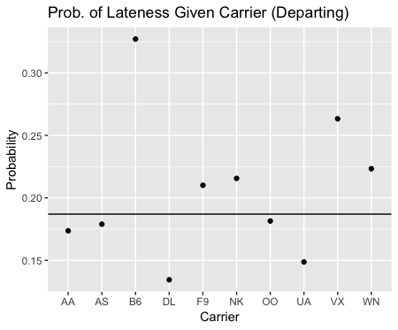
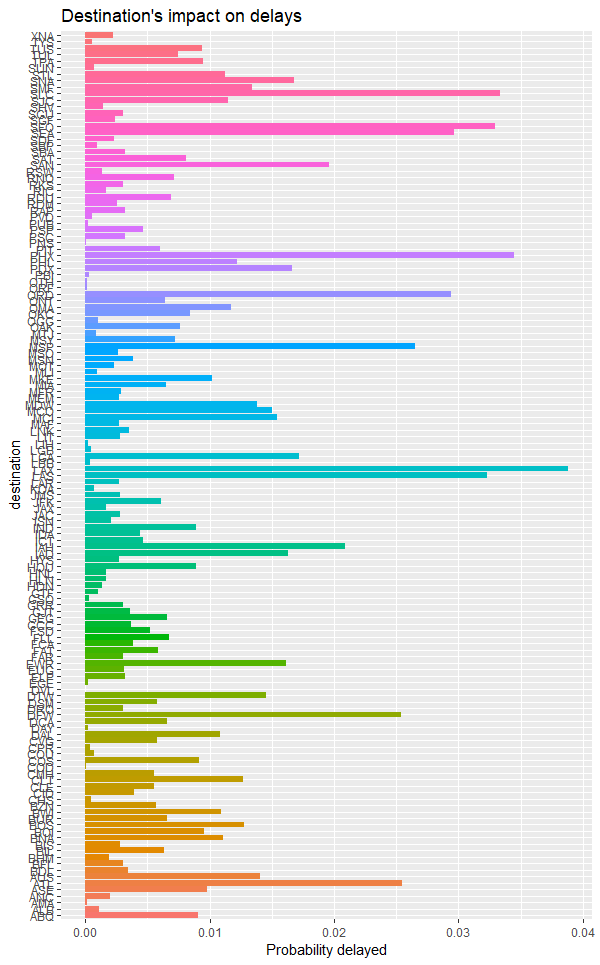
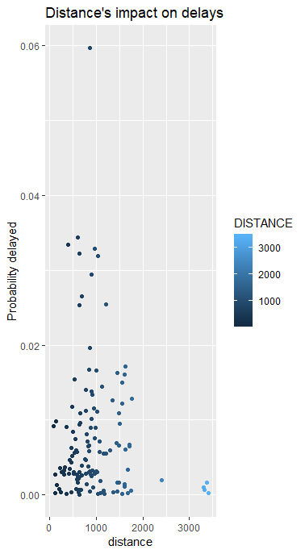
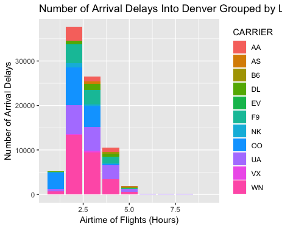
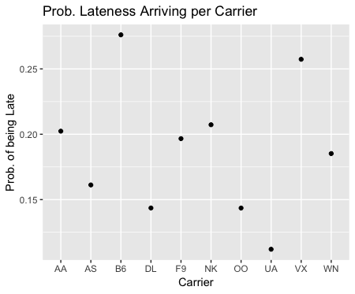

```{r setup, include=FALSE}
knitr::opts_chunk$set(echo = TRUE)

library(tidyverse)
COflights <- read_csv("https://files.osf.io/v1/resources/3z5as4pej8/providers/osfstorage/5a8ca28f57103100104584db")
```

# The Causes of Delays in Denver International Airport

### Why it is important
Most people hate when their flight is delayed. Not only does it cause problems with scheduling for the airports, but it also can cause chaos with passenger's own itineraries. In order to keep passengers happy and airports running smoothly, the airport must know why flights arrive later than expected.

In particular, the question of why some flights are delayed is complex, as a number of issues can arise which can cause a delay. Below, we have analyzed multiple factors that could contribute to an airplane delay and have come up with recommendations in how the airport could try and solve the issues.

---

### Group Plot 1
```{r, eval=FALSE}
#Plot
ggplot(data=DENflights_test)+geom_bar(aes(x=CARRIER,fill=as.factor(LATE)),position="Dodge")+labs(x="Carrier",y="count",title='Late Flights Per Carrier')
#Calculating Conditional probability for arriving late given flown WN
WN_and_late<-filter(DENflights_late,CARRIER=="WN")
WN_flights<-filter(DENflights,CARRIER=="WN")
late_given_WN = (12577/221642)/(67986/221642)
#Calculating Conditional probability for arriving late given flown UA
UA_and_late<-filter(DENflights_late,CARRIER=='UA')
UA_flights<-filter(DENflights,CARRIER=='UA')
late_give_UA<-6889/61629
#Conditional Probability versus Carrier Plot
prob_vs_carrier<- DENflights_test %>%
  group_by(CARRIER)%>%
  summarize(total_late=sum(LATE),count=n())%>%
  mutate(prob = total_late/count)
view(prob_vs_carrier)

ggplot(data=prob_vs_carrier)+geom_point(aes(x=CARRIER,y=prob))+labs(x="Carrier",y="Prob. of being Late",title="Conditional Prob. of being Late Vs. Carrier")

```



From this plot, it is clear that there are some airlines that have a significantly higher probability of arriving late. In the plot above, the horizontal line is the general probability of arriving late. Out of all the carriers above the horizontal line, the most popular carrier is WN, or more commonly known as SouthWest Airlines. Also, B6 (JetBlue) has the highest probability of being late. 

### Group Plot 2
Most people would agree that a Security Delay or a delay with the National Air System, or the a delay caused by a disturbance within our national airspace, causes delay, but the question is how much of a delay and how often does it occur. Below is the summary of data.

```{r, eval=FALSE}
DENflights <- COflights %>%
  filter (ORIGIN== 'DEN', CANCELLED== 0, DIVERTED== 0)

DENsec <-DENflights %>%
  filter (SECURITY_DELAY > 0, ARR_DELAY >=15) %>%
  select ("YEAR", "MONTH", "DAY_OF_MONTH", "SECURITY_DELAY", "ARR_DELAY")

DENnas <-DENflights %>%
  filter (NAS_DELAY > 0, ARR_DELAY >=15) %>%
  select ("YEAR", "MONTH", "DAY_OF_MONTH", "NAS_DELAY", "ARR_DELAY")

DENtdelay <- COflights %>%
  filter (ARR_DELAY >= 15)
```

__Probability that a DEN Flight will be Delayed for Security Reasons: 38/2231148__

__Probability that a DEN Flight that has Security Delay is Delayed: 38/38__

__Percent of Delays that are for Security Reasons: 38/82183__

__Probability that a DEN Flight will be Delayed for National Air System Reasons: 23199/221148__

__Probability that a DEN Flight that has National Air System Delay is Delayed: 23199/23199__

__Percent of Delays that are for National Air System Reaons: 23199/82183__

```{r, eval=FALSE}
ggplot(dat=DENsec)+
    geom_point(mapping=aes(x=SECURITY_DELAY, y=ARR_DELAY, color=MONTH),)+
    labs(x="Security Delay (Minutes)", y= "Arrival Delay (Minutes)", title= "Security Delay and Arrival Time")+
    scale_color_gradientn(colors= rainbow(6))+
    theme(legend.background= element_rect(size= 0.3, linetype= "solid", color= "black"))+
    scale_fill_discrete(name= "Month")
  
ggplot(dat=DENnas)+
  geom_point(mapping=aes(x=NAS_DELAY, y=ARR_DELAY, color=MONTH), position= "jitter")+
  labs(x="National Air System Delay (Minutes)", y= "Arrival Delay (Minutes)", title= "National Air System Delay and Arrival Time")+
  scale_color_gradientn(colors= rainbow(6))+
  theme(legend.background= element_rect(size= 0.3, linetype= "solid", color= "black"))+
  scale_fill_discrete(name= "Month")
```


---

###Recomended
While we believe to have isolated certain factors associated with delays, some of these factors cannot be helped. For example, in order for airports to make money, they must have airplanes fly in and out of the airport. This means an airport cannot be picky about which carriers they allow to land. Similarly, the National Air System (NAS) is not controlled by any one airport, so any NAS delay cannot be prevented by the airports.

---
## Desination, Departure Time (Chris)
__The impact of destination and departure delay:__ 


As seen in this plot, the destination of flights leaving DIA has a large impact on the probability of there being a departure delay. 

__The impact of distance and departure delay:__


As seen in this plot, the distance an airport is away from DIA does impact if there will be a delay or not. If an airport is under 1500 miles away from DIA, there is a much higher probability that there will be a delay than if it is 2000 miles or further away. Around 1000 miles away has the largest probability of being delayed. 

```{r, eval=FALSE}

#destination probability of delays:

den_flights <- filter(COflights,ORIGIN == 'DEN') %>%
  select(ORIGIN, DEST, DEP_TIME, DEP_DELAY) %>%
  na.omit

dest_den <- den_flights %>%
  group_by(DEST) %>%
  summarize(mean_wait = mean(DEP_DELAY), count = n()) %>%
  arrange(desc(mean_wait))%>%
  mutate(prob_delayed = count/ 221780)

ggplot(dest_den, aes(x = DEST, y = prob_delayed, fill = DEST))+
  geom_col()+
  coord_flip()+
  theme(legend.position = "none")+
   labs(x = "destination" , y= "Probability delayed", title= "Destination's impact on delays")

#distance probability of delays: 

den_flights2 <- filter(COflights, ORIGIN == 'DEN') %>%
  select(ORIGIN, DEST, DEP_DELAY, DISTANCE) %>%
  na.omit

dist_den <- den_flights2 %>%
  group_by(DISTANCE) %>%
  summarize(mean_dist = mean(DISTANCE), count1 = n()) %>%
  arrange(desc(mean_dist)) %>%
  mutate(prob_delayed2 = count1 / 221780)

ggplot(dist_den , aes(x = DISTANCE, y = prob_delayed2, color = DISTANCE))+
  geom_point()+
  labs(x = "distance" , y= "Probability delayed", title= "Distance's impact on delays")

```

## Arrival Time, Air Time (Amanda)


``` {r, eval=FALSE}

lateFlights <- COflights %>%
mutate(LATE=ifelse(ARR_DELAY >=15,1,0)) %>% mutate(AIRTIME_HOURS = ceiling(AIR_TIME/60))
lateFlights <- COflights %>%
    mutate(LATE=ifelse(ARR_DELAY >=15,1,0)) %>% mutate(AIRTIME_HOURS = ceiling(AIR_TIME/60))
#view(lateFlights)
ggplot(data = lateFlights) + geom_col(aes(x=AIRTIME_HOURS, y=LATE, fill = CARRIER)) + 
labs(x="Airtime of Flights (Hours)", y="Number of Arrival Delays", title = "Number of Arrival Delays Into Denver Grouped by Length of Flight")

```

This plot looks at the relationship between the length of a fight (how long the plane is in the air for) and compares it to whether or not the flight is delayed or not, in order to visualize if there is a correlation between the airtime of a flight and its chances of being delayed. The graph shows that most flights were delayed when they were around one hour long, and as the length of flights increased, the number of delayed flights started decreasing.

This plot also compares a second variable to the timeliness of a flight: carrier. For each type of flight (based on airtime), the plot illustrates the proportion of those delayed flights that were by a certain character. From this depiction, two observations can be seen:

1.  We can see if certain carriers have more late flights of one length than of another length. For example, from the plot we can see that in the smallest flight length category, OO was responsible for all of the late flights, but they had a lot less late flights in the other categories. This could either be because this airline has some problem with their shorter flights that makes them delayed more, or they could just have more short flights in general, so they naturally see more delayed flights that are short.

2. We can see if there is an overarching theme of which carriers tend to have a larger proportion of delayed fights relative to other carriers. For example, WV appeared to have the most delayed flights relative to every other carrier in every length of flight. On the other hand, VX, NK, B6, and AS had a lot less delayed flights compared to the other carriers.

## Effect of Carriers on Arriving Late to DIA  (James)


One interesting question is for all flights that arrive at DIA, does the carrier have any impact of the whether the flight was delayed. The answer is yes. Out of all the carriers, the conditional probability of being late given that one flew Southwest Airlines is higher than the probability of arriving late. The probability of arriving late to DIA is 0.157, while the probability of arriving late given that one flew Southwest is 0.185. Another interesting fact is that by flying United Airlines, the probability of arriving late in DIA is 0.11. This means that if one wants to have a lower probability of arriving late, flying United would be a smart option. Given that these two carriers arrive the most at DIA, it is clear that United has an advantage if one wants to arrive on time. From the plot of conditional probabilities, it's clear that there are other carriers that have higher probabilities of being late, but given that there were fewer observations, it would be more advantageous to look at the two most popular carriers. 

```{r, eval=FALSE}
#Plot
ggplot(data=DENflights_test)+geom_bar(aes(x=CARRIER,fill=as.factor(LATE)),position="Dodge")+labs(x="Carrier",y="count",title='Late Flights Per Carrier')
#Calculating Conditional probability for arriving late given flown WN
WN_and_late<-filter(DENflights_late,CARRIER=="WN")
WN_flights<-filter(DENflights,CARRIER=="WN")
late_given_WN = (12577/221642)/(67986/221642)
#Calculating Conditional probability for arriving late given flown UA
UA_and_late<-filter(DENflights_late,CARRIER=='UA')
UA_flights<-filter(DENflights,CARRIER=='UA')
late_give_UA<-6889/61629
#Conditional Probability versus Carrier Plot
prob_vs_carrier<- DENflights_test %>%
  group_by(CARRIER)%>%
  summarize(total_late=sum(LATE),count=n())%>%
  mutate(prob = total_late/count)
view(prob_vs_carrier)

ggplot(data=prob_vs_carrier)+geom_point(aes(x=CARRIER,y=prob))+labs(x="Carrier",y="Prob. of being Late",title="Conditional Prob. of being Late Vs. Carrier")

```

## Month and Day Delays (Anna)
Although Month and Day are likely not correlated, it is still important to check. 
``` {r, eval=FALSE}
DENflights <- COflights %>%
  filter (ORIGIN== 'DEN', CANCELLED== 0, DIVERTED== 0)

DENmon <-DENflights %>%
  mutate(DELAY= ARR_DELAY>=15) %>%
  select ("MONTH", "DELAY", "ARR_DELAY")

DENjan <- DENmon %>%
  filter(MONTH== 1)

DENday <-DENflights %>%
  mutate(DELAY= ARR_DELAY>=15) %>%
  select ("DAY_OF_MONTH", "DELAY", "ARR_DELAY")

DENsev <- DENday %>%
  filter(DAY_OF_MONTH== 7)

ggplot (data= DENmon)+
  geom_bar(mapping= aes(x= as.factor(MONTH), fill= DELAY), position= "fill")+
  labs(x= "Month", y= "Number of Flights", title= "Month and Number of Delayed Flights")+
  scale_x_discrete(breaks= c("1","2","3","4","5","6","7","8","9","10","11","12"),
                   labels=c("January","Febuary","March","April","May","June","July","August","September","October","November","December"))+
  theme(axis.text.x= element_text(angle=45))+
  scale_fill_manual(values=c("Blue","Red"), name= "Delay", breaks= c("FALSE","TRUE"), labels= c("No","Yes"))

ggplot (data= DENday)+
  geom_bar(mapping= aes(x= as.factor(DAY_OF_MONTH), fill= DELAY), position= "fill")+
  labs(x= "Day", y= "Number of Flights", title= "Day and Number of Delayed Flights")+
  theme(axis.text.x= element_text(angle=45))+
  scale_fill_manual(values=c("Blue","Red"), name= "Delay", breaks= c("FALSE","TRUE"), labels= c("No", "Yes"))
```

 


As you can see from the plots, there is not any strong correlation between Day or Month. There is slightly more delays in the winter months, but not enough to make any significant difference between months. Below is the joint probabilities of the highest percent missed in each category.

__Probability a Plane was Late and the month was January: 16691/221148__

__Probability a Plane was Late and the day was the 7th: 7039/221148__

