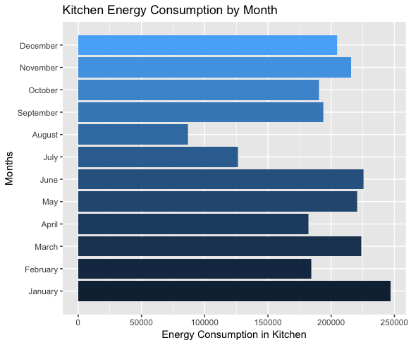

```{r setup, include=FALSE}
knitr::opts_chunk$set(echo = TRUE)
```

```{r, eval=FALSE}
## RUN THIS CODE TO GET THE DATA! (WE CAN TIDY LATER)
library(tidyverse)
housepwr <- read.table(unz("household_power_consumption.zip", "household_power_consumption.txt"),
                        sep= ";", header= T, na.strings = c("NA","","?"), stringsAsFactors = FALSE)
na.omit(housepwr)
 
```
# Dataset Description

This dataset is describing the energy consumption of one household near Paris, France over the course of four years. 
It reads in data for every minute of these four years to see their overall consumption, and their consumption in each category: heating and cooling, kitchen, and laundry.
For every day, there is a separate time given by the hour and minutes to see how much energy they used at that time. 

We dealt with NAs by using the code: na.strings= c("NA","","?"). This made it so everything with one of those characters would be considered NA.

---

## Amanda (month, submetering 1)

The question I wanted to answer was how does energy consumption in the kitchen change across months?

To answer this question, I split up the date so that I could have year, month, and day all in their own columns so I could split all the data up by months.
Then, I created a graph comparing the kitchen energy consumption month by month to see which month used the most. 
I also used a function to change the names of the Months axis, changed the color of the bars so it would be more aesthetically pleasing, changed the labels of the axes, and flipped the coordinates.



```
householdPowerConsumption <- read.table("~/Downloads/household_power_consumption.txt", header=T, na.strings=c("NA", "", "?"), sep=";", stringsAsFactors = FALSE)

householdPwr <- householdPowerConsumption %>% separate(Date, into=c("Day", "Month", "Year"), sep = "/", convert = TRUE)
View(householdPwr)
summary(householdPwr)

ggplot(data = householdPwr, aes(x=Month, y= Sub_metering_1, fill = Month)) + geom_col() + labs(x="Months", y="Energy Consumption in Kitchen", title="Kitchen Energy Consumption by Month") + 
scale_x_discrete(limits = c("January", "February", "March", "April", "May", "June", "July", "August", "September", "October", "November", "December")) + coord_flip() + theme(legend.position = "none")

```

The data shows that there tends to be more kitchen energy consumption in the winter months, with the most use in January, and the least in August. August used half as much energy than January in the kitchen. 
I thought this question was interesting because I wasn't sure if the time of year would have any effect on how much people use the kitchen. So when I made the graph, I was surprised to see that people did in fact use less energy in the kitchen in summer months.
In order to figure out what question to do, I had to do some exploratory data analysis techniques. I had no idea what any of the categories were so the first step was to play with the numbers in each column and see how they were related to eachother.
I also played with summing up values and taking averages to see how much the data differed. I was really excited by the fact the data was split up into different categories, which is how  I decided to focus my research on the kitchen.

Using the summary function, I looked at the maximum values of kitchen energy consumption versus the mean to see how different they were. The maximum value was 88 watt-hours and the average was 1.122 watt-hours, which tells me that there were some times where much more energy was needed in the kitchen than others.

## James

## Chris

How does average global active power change every month throughout the four years? 

```{r, eval=FALSE}
householdpwr<-housepwr %>% 
  separate(Date, into = c("Day","Month","Year"), sep = "/", convert = TRUE) %>%
  select(Day,Month,Year,Global_active_power)

householdpwr2 <- householdpwr %>%
  group_by(Year, Month) %>%
  summarize(mean_pwr = mean(Global_active_power, na.rm = TRUE) , count = n())

ggplot(householdpwr2 , aes(x = Month , y = mean_pwr , color = Year, group = Year))+ 
  geom_point()+ geom_path()+
  scale_x_continuous(breaks = seq(1, 12, by = 1)) +
  ylab('Average power used in a day per month (KW/H)')+
  scale_colour_gradientn(colors=rainbow(4))

```


Quesiton: how does average energy use change month by month, and how do these monthly changes compare yearly? 

I addressed this question by sorting the given data set to reflect the average daily use of global power in a house over all the months of the year for a little over four years. I then made a plot of these findings to visualize the patterns that occur over this span of time. 

I found that there are some monthly trends that occur over the span of the years. We see that energy consumption is much higher in the colder months (January-March and October-December) than in the warmer months (April-September). We see this trend as peaks in energy in December and January and significant drops in August. The trends remain consistent over the four years with some deviations, but generally retain the same patten. We don't see any yearly trends as every month in a year doesn't follow a strictly lower or strictly higher trend compared to previous years. I think my question is interesting becasue its informative for energy companies or people who are budgeting if they want to tie a monetary value as to when the most and least power are used. This monthly data can be reflective of other households in similar climates in the northern hemisphere. 

I came up with this quesstion after reading what the variables stood for. I saw organized columns with different variables, and one of them containted a date that was not parsed into day, month and year, so I wanted tow try and do this technique as practice. I also saw that every row was an observation based on time, so I knew my analysis should be dependent on time in some general sense; therefore, I chose a more macroscopic view of time and analyzed months and years. The final reason I chose to analyze monthly and yearly statistics for average power used was beccause I noticed there were 2 million different observations, and I wanted a more narrow scope to analyze as it compresses the large data set into a much more manageble set. 

## Anna

The question that I am attempting to solve is: Is there a difference in energy usage for heating and cooling per over the years?

To solve this question, I picked two months (June and December) where I though the difference between energy usage would be high (as many people use heating/cooling this month). I created many tibbles that isolated the time (in minutes) and Sub_metering_3 (which measured energy usage of heating and cooling). I choose one day out of each month and year combination (all around the same date) and made sure it had 1440 data points. I then put the data into a ggplot. I chose to use geom_step as the data was not a completly continuous series, but functioned close enough to one.

```{r, eval=FALSE}
# Loading the Data
housepwr <- read.delim(unz("household_power_consumption.zip", "household_power_consumption.txt"), 
                       sep= ";",  
                       header= TRUE,  
                       na.strings= c("NA","","?"),  
                       stringsAsFactors= FALSE) 
 
housemon <- housepwr %>% 
  separate(Date, into= c("day","month","year"), sep= "/", convert= TRUE)

## June Data and Plot
house6.7 <- housemon%>%
  filter(month== 6, year== 2007, day== 12)%>%
  separate(Time, c("hour", "min", "sec"), sep= ":", convert= TRUE)

house6.7.1 <- house6.7%>%
  mutate(Minute= (hour*60)+min)%>%
  select("Minute", "Sub_metering_3")

house6.8 <- housemon%>%
  filter(month== 6, year== 2008, day== 16)%>%
  separate(Time, c("hour", "min", "sec"), sep= ":", convert= TRUE)

house6.8.1 <- house6.8%>%
  mutate(Minute= (hour*60)+min)%>%
  select("Minute", "Sub_metering_3")

house6.9 <- housemon%>%
  filter(month== 6, year== 2009, day== 16)%>%
  separate(Time, c("hour", "min", "sec"), sep= ":", convert= TRUE)

house6.9.1 <- house6.9%>%
  mutate(Minute= (hour*60)+min)%>%
  select("Minute", "Sub_metering_3")

house6.10 <- housemon%>%
  filter(month== 6, year== 2010, day==17)%>%
  separate(Time, c("hour", "min", "sec"), sep= ":", convert= TRUE)

house6.10.1 <- house6.10%>%
  mutate(Minute= (hour*60)+min)%>%
  select("Minute", "Sub_metering_3")

ggplot()+
  geom_line(data= house6.7.1, mapping=aes(x=Minute, y=Sub_metering_3, color="Red"))+
  geom_line(data= house6.8.1, mapping=aes(x=Minute, y=Sub_metering_3, color="Yellow"))+
  geom_line(data= house6.9.1, mapping=aes(x=Minute, y=Sub_metering_3, color="Green"))+
  geom_line(data= house6.10.1, mapping=aes(x=Minute, y=Sub_metering_3, color="Blue"))+
  labs(x="Time", 
       y="Watt Hours of energy used for Heating and Cooling", 
       title="Change in Energy Usage for Heating and Cooling in December from 2006 to 2009")+
  theme(legend.position="right")+
  scale_color_discrete(name="Year", breaks=c("Red","Yellow","Green","Blue"), labels=c("2007","2008","2009","2010"))+
  scale_x_time(breaks=c("0","360","720","1080","1440"),labels=c("0:00", "6:00", "12:00", "18:00","24:00"))

## December Data and Plot
house12.6 <- housemon%>%
  filter(month== 12, year== 2006, day== 18)%>%
  separate(Time, c("hour", "min", "sec"), sep= ":", convert= TRUE)

house12.6.1 <- house12.6%>%
  mutate(Minute= (hour*60)+min)%>%
  select("Minute", "Sub_metering_3")

house12.7 <- housemon%>%
  filter(month== 12, year== 2007, day== 15)%>%
  separate(Time, c("hour", "min", "sec"), sep= ":", convert= TRUE)

house12.7.1 <- house12.7%>%
  mutate(Minute= (hour*60)+min)%>%
  select("Minute", "Sub_metering_3")

house12.8 <- housemon%>%
  filter(month== 12, year== 2008, day== 12)%>%
  separate(Time, c("hour", "min", "sec"), sep= ":", convert= TRUE)

house12.8.1 <- house12.8%>%
  mutate(Minute= (hour*60)+min)%>%
  select("Minute", "Sub_metering_3")

house12.9 <- housemon%>%
  filter(month== 12, year== 2009, day==8)%>%
  separate(Time, c("hour", "min", "sec"), sep= ":", convert= TRUE)

house12.9.1 <- house12.9%>%
  mutate(Minute= (hour*60)+min)%>%
  select("Minute", "Sub_metering_3")
  
ggplot()+
  geom_line(data= house12.6.1, mapping=aes(x=Minute, y=Sub_metering_3, color="Red"))+
  geom_line(data= house12.7.1, mapping=aes(x=Minute, y=Sub_metering_3, color="Yellow"))+
  geom_line(data= house12.8.1, mapping=aes(x=Minute, y=Sub_metering_3, color="Green"))+
  geom_line(data= house12.9.1, mapping=aes(x=Minute, y=Sub_metering_3, color="Blue"))+
  labs(x="Time", 
       y="Watt Hours of energy used for Heating and Cooling", 
       title="Change in Energy Usage for Heating and Cooling in December from 2006 to 2009")+
  theme(legend.position="right")+
  scale_color_discrete(name="Year", breaks=c("Red","Yellow","Green","Blue"), labels=c("2006","2007","2008","2009"))+
  scale_x_time(breaks=c("0","360","720","1080","1440"),labels=c("0:00", "6:00", "12:00", "18:00","24:00"))
```


As you can see from the graphs above, later years in both the months of June and December used more power overall; however, there is no significat difference between the years. This means that while it is likely that people use more power for heating/cooling than previous years, there is not a significant difference. This finding is important because as humanity looks towards being more energy conscious, it is important to see where energy usage has increased within the household. Then, companies and non-profits can help educate others decrease their overall energy usage.

