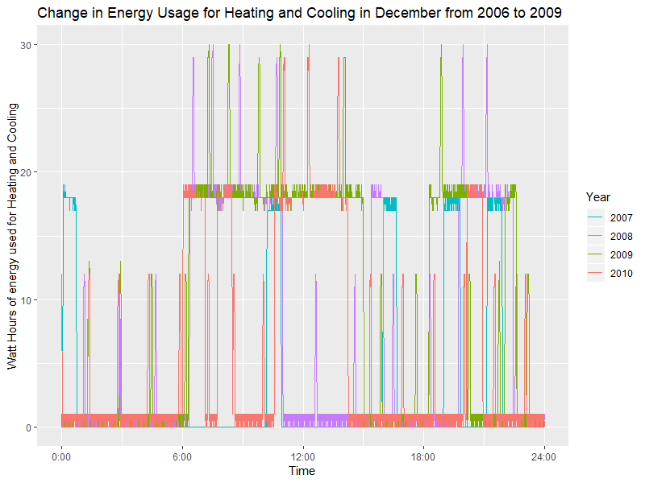
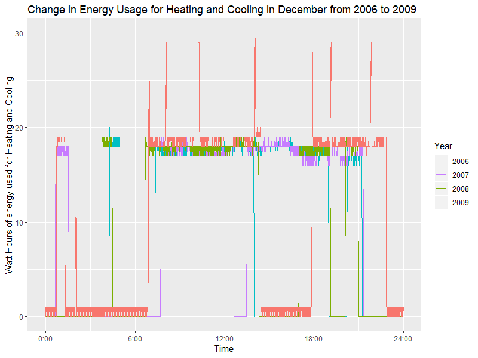

```{r setup, include=FALSE}
knitr::opts_chunk$set(echo = TRUE)
```

```{r, eval=FALSE}
## RUN THIS CODE TO GET THE DATA! (WE CAN TIDY LATER)
library(tidyverse)
housepwr <- read.table(unz("household_power_consumption.zip", "household_power_consumption.txt"),
                        sep= ";", header= T, na.strings = c("NA","","?"), stringsAsFactors = FALSE)
na.omit(housepwr)
 
```
str
# Findings

# Dataset Description

<<<<<<< HEAD
---
<<<<<<< HEAD

## Amanda (month, submetering 1)

```
householdPowerConsumption <- read.table("~/Downloads/household_power_consumption.txt", header=T, na.strings=c("NA", "", "?"), sep=";", stringsAsFactors = FALSE)

householdPwr <- householdPowerConsumption %>% separate(Date, into=c("Day", "Month", "Year"), sep = "/", convert = TRUE)
View(householdPwr)

ggplot(data = householdPwr, aes(x=Month, y= Sub_metering_1, fill = Month)) + geom_col() + labs(x="Months", y="Energy Consumption in Kitchen", title="Kitchen Energy Consumption by Month") + 
scale_x_discrete(limits = c("January", "February", "March", "April", "May", "June", "July", "August", "September", "October", "November", "December")) + coord_flip() + theme(legend.position = "none")
=======
>>>>>>> master

```

<<<<<<< HEAD
How does energy consumption in the kitchen change across months?
=======
---
>>>>>>> master

## Amanda

<<<<<<< HEAD
=======
How does energy consumption in the kitchen change across months?
How does the proportion of each type of energy consumption change across months?
>>>>>>> master

How do i address question

-graph
-summary statistic


## James

## Chris

How does average global active power change every month throughout the four years? 

```{r, eval=FALSE}
householdpwr<-housepwr %>% 
  separate(Date, into = c("Day","Month","Year"), sep = "/", convert = TRUE) %>%
  select(Day,Month,Year,Global_active_power)

householdpwr2 <- householdpwr %>%
  group_by(Year, Month) %>%
  summarize(mean_pwr = mean(Global_active_power, na.rm = TRUE) , count = n())

```
## Anna

The question that I am attempting to solve is: Is there a difference in energy usage for heating and cooling per over the years?

To solve this question, I picked two months (June and December) where I though the difference between energy usage would be high (as many people use heating/cooling this month). I created many tibbles that isolated the time (in minutes) and Sub_metering_3 (which measured energy usage of heating and cooling). I choose one day out of each month and year combination (all around the same date) and made sure it had 1440 data points. I then put the data into a ggplot. I chose to use geom_step as the data was not a completly continuous series, but functioned close enough to one.

```{r, eval=FALSE}
# Loading the Data
housepwr <- read.delim(unz("household_power_consumption.zip", "household_power_consumption.txt"), 
                       sep= ";",  
                       header= TRUE,  
                       na.strings= c("NA","","?"),  
                       stringsAsFactors= FALSE) 
 
housemon <- housepwr %>% 
  separate(Date, into= c("day","month","year"), sep= "/", convert= TRUE)

## June Data and Plot
house6.7 <- housemon%>%
  filter(month== 6, year== 2007, day== 12)%>%
  separate(Time, c("hour", "min", "sec"), sep= ":", convert= TRUE)

house6.7.1 <- house6.7%>%
  mutate(Minute= (hour*60)+min)%>%
  select("Minute", "Sub_metering_3")

house6.8 <- housemon%>%
  filter(month== 6, year== 2008, day== 16)%>%
  separate(Time, c("hour", "min", "sec"), sep= ":", convert= TRUE)

house6.8.1 <- house6.8%>%
  mutate(Minute= (hour*60)+min)%>%
  select("Minute", "Sub_metering_3")

house6.9 <- housemon%>%
  filter(month== 6, year== 2009, day== 16)%>%
  separate(Time, c("hour", "min", "sec"), sep= ":", convert= TRUE)

house6.9.1 <- house6.9%>%
  mutate(Minute= (hour*60)+min)%>%
  select("Minute", "Sub_metering_3")

house6.10 <- housemon%>%
  filter(month== 6, year== 2010, day==17)%>%
  separate(Time, c("hour", "min", "sec"), sep= ":", convert= TRUE)

house6.10.1 <- house6.10%>%
  mutate(Minute= (hour*60)+min)%>%
  select("Minute", "Sub_metering_3")

ggplot()+
  geom_line(data= house6.7.1, mapping=aes(x=Minute, y=Sub_metering_3, color="Red"))+
  geom_line(data= house6.8.1, mapping=aes(x=Minute, y=Sub_metering_3, color="Yellow"))+
  geom_line(data= house6.9.1, mapping=aes(x=Minute, y=Sub_metering_3, color="Green"))+
  geom_line(data= house6.10.1, mapping=aes(x=Minute, y=Sub_metering_3, color="Blue"))+
  labs(x="Time", 
       y="Watt Hours of energy used for Heating and Cooling", 
       title="Change in Energy Usage for Heating and Cooling in December from 2006 to 2009")+
  theme(legend.position="right")+
  scale_color_discrete(name="Year", breaks=c("Red","Yellow","Green","Blue"), labels=c("2007","2008","2009","2010"))+
  scale_x_time(breaks=c("0","360","720","1080","1440"),labels=c("0:00", "6:00", "12:00", "18:00","24:00"))

## December Data and Plot
house12.6 <- housemon%>%
  filter(month== 12, year== 2006, day== 18)%>%
  separate(Time, c("hour", "min", "sec"), sep= ":", convert= TRUE)

house12.6.1 <- house12.6%>%
  mutate(Minute= (hour*60)+min)%>%
  select("Minute", "Sub_metering_3")

house12.7 <- housemon%>%
  filter(month== 12, year== 2007, day== 15)%>%
  separate(Time, c("hour", "min", "sec"), sep= ":", convert= TRUE)

house12.7.1 <- house12.7%>%
  mutate(Minute= (hour*60)+min)%>%
  select("Minute", "Sub_metering_3")

house12.8 <- housemon%>%
  filter(month== 12, year== 2008, day== 12)%>%
  separate(Time, c("hour", "min", "sec"), sep= ":", convert= TRUE)

house12.8.1 <- house12.8%>%
  mutate(Minute= (hour*60)+min)%>%
  select("Minute", "Sub_metering_3")

house12.9 <- housemon%>%
  filter(month== 12, year== 2009, day==8)%>%
  separate(Time, c("hour", "min", "sec"), sep= ":", convert= TRUE)

house12.9.1 <- house12.9%>%
  mutate(Minute= (hour*60)+min)%>%
  select("Minute", "Sub_metering_3")
  
ggplot()+
  geom_line(data= house12.6.1, mapping=aes(x=Minute, y=Sub_metering_3, color="Red"))+
  geom_line(data= house12.7.1, mapping=aes(x=Minute, y=Sub_metering_3, color="Yellow"))+
  geom_line(data= house12.8.1, mapping=aes(x=Minute, y=Sub_metering_3, color="Green"))+
  geom_line(data= house12.9.1, mapping=aes(x=Minute, y=Sub_metering_3, color="Blue"))+
  labs(x="Time", 
       y="Watt Hours of energy used for Heating and Cooling", 
       title="Change in Energy Usage for Heating and Cooling in December from 2006 to 2009")+
  theme(legend.position="right")+
  scale_color_discrete(name="Year", breaks=c("Red","Yellow","Green","Blue"), labels=c("2006","2007","2008","2009"))+
  scale_x_time(breaks=c("0","360","720","1080","1440"),labels=c("0:00", "6:00", "12:00", "18:00","24:00"))
```




As you can see from the graphs above, later years in both the months of June and December used more power overall.