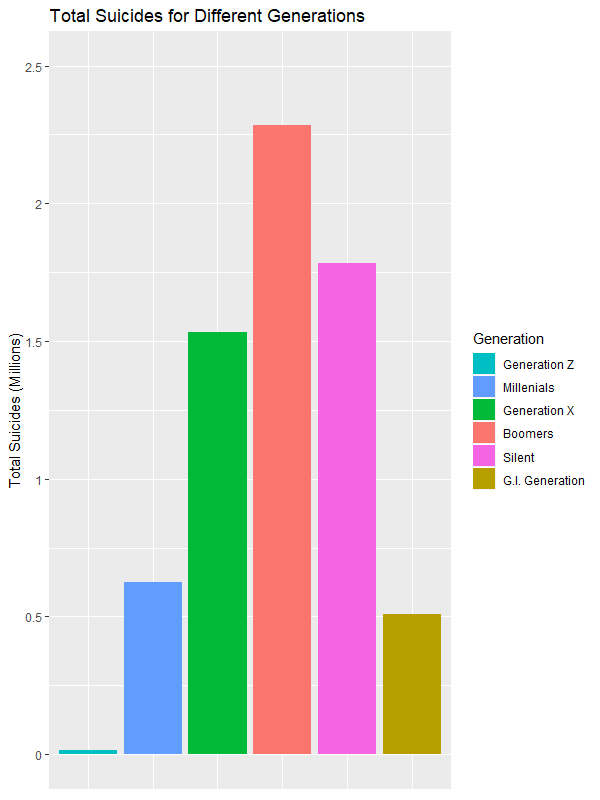
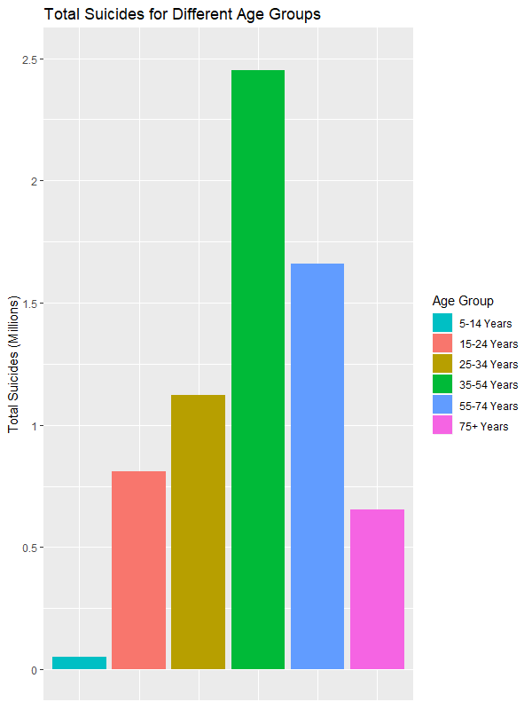

```{r setup, include=FALSE}
knitr::opts_chunk$set(echo = TRUE)

library(tidyverse)
install.packages("readxl")
library(readxl)
suicides <- read.table(file= "master.xls", sep= "\t", header= TRUE)

```
# QUESTION
Dataset: https://www.kaggle.com/russellyates88/suicide-rates-overview-1985-to-2016

Mental health is becoming more and more important in relation to overall health and wellbeing. In the instance where mental health is not being taken care of, people can turn to addictive substances, preversive behavior, or even death.

###Why important

###Overall Summary

###Reconmendatioins

---

### Chris (GDP, #)

### Amanda (Gender, #)
I want to kow about stuff

### James (Who knows)

### Anna (Generation/Age, #)
My variables looked at the difference in age and generation with total numbers of suicides. Knowing this information would greatly help countries and other health promotion organizations better distribute resources in order to prevent suicides.

__Generation Breakdown (approximate)__
Generation Name      | Age Breakdown (Years)
-------------------- | ------------- 
Generation Z         | 7-24        
Millennials          | 25-39   
Generation X         | 40-54  
Baby Boomer          | 55-73  
Silent Generation    | 74-94  
G.I. Generation      | 95-109  

To answer this question, I first sorted out the varibles I wanted (age, generation, and suicides_no) and then sumed the suicides_no associated with each generation/age. I then created a ggplot bar graph to show the difference between each variable (age/generation).  

```{r, echo= FALSE}
# Primary Sorting
agecount <- suicides %>%
  select("age", "suicides_no", "generation")

# Breakdown of Variables
generationtotal <- agecount %>%
  group_by(generation) %>%
  summarise(total= sum(suicides_no))

agetotal <- agecount %>%
  group_by(age) %>%
  summarise(total=sum(suicides_no))

# ggplot Code
ggplot(data= generationtotal)+
  geom_bar(mapping= aes(x=generation, y=total, fill=generation), stat= "identity")+
  labs(title= "Total Suicides for Different Generations")+
  scale_y_continuous(name= "Total Suicides (Millions)",
                     breaks= c(0, 500000, 1000000, 1500000, 2000000, 2500000), 
                     labels= c("0", "0.5", "1", "1.5", "2", "2.5"),
                     limits= c(0,2500000))+
  scale_x_discrete(limits= c("Generation Z", "Millenials", "Generation X", "Boomers", "Silent", "G.I. Generation"))+
  theme(axis.title.x=element_blank(), axis.text.x= element_blank(), axis.ticks.x=element_blank())+
  scale_fill_discrete(name= "Generation",
                      breaks= c("Generation Z", "Millenials", "Generation X", "Boomers", "Silent", "G.I. Generation"))
                      
ggplot(data= agetotal)+
  geom_bar(mapping=aes(x=age, y=total, fill=age), stat= "identity")+
  labs(y="Total Suicides", title= "Total Suicides for Different Age Groups")+
  scale_y_continuous(name= "Total Suicides (Millions)",
                     breaks= c(0, 500000, 1000000, 1500000, 2000000, 2500000), 
                     labels= c("0", "0.5", "1", "1.5", "2", "2.5"),
                     limits= c(0,2500000))+
  scale_x_discrete(limits= c("5-14 years","15-24 years", "25-34 years", "35-54 years", "55-74 years", "75+ years"))+
  theme(axis.title.x=element_blank(), axis.text.x= element_blank(), axis.ticks.x=element_blank())+
  scale_fill_discrete(name= "Age Group",
                      breaks= c("5-14 years","15-24 years", "25-34 years", "35-54 years", "55-74 years", "75+ years"),
                      labels=c("5-14 Years","15-24 Years", "25-34 Years", "35-54 Years", "55-74 Years", "75+ Years"))
```




From these two graphs, one can clearly see that the largest age group and generation is those 35-54 years old and the Baby Boomer generation. This information can help health professionals better information on which individuals are more likely to commit suicide. 
