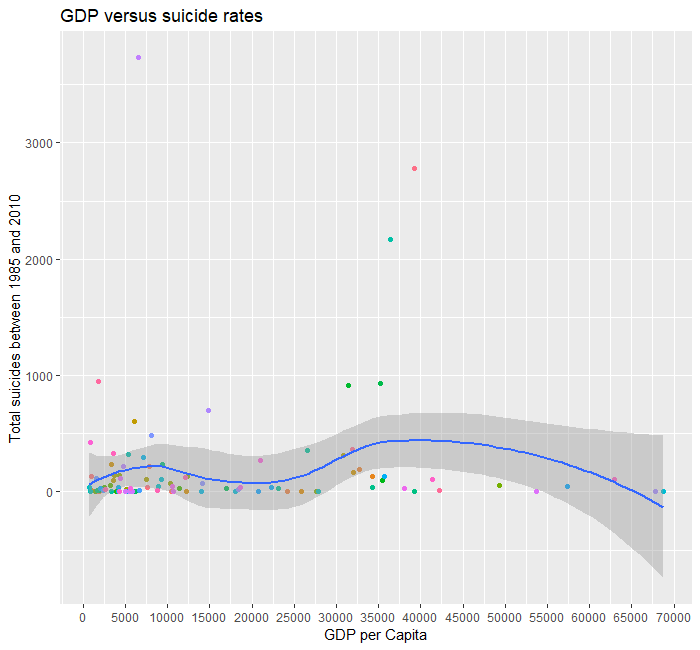
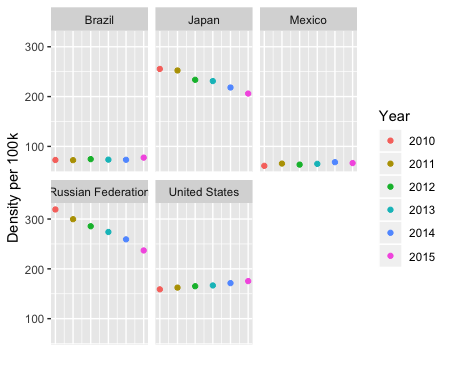
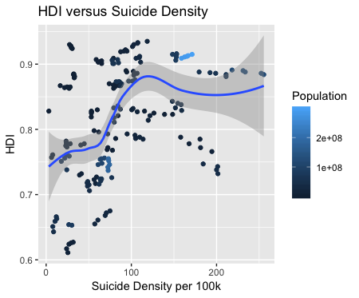

```{r setup, include=FALSE}
knitr::opts_chunk$set(echo = TRUE)

```
# Suicide Prevention
Dataset: https://www.kaggle.com/russellyates88/suicide-rates-overview-1985-to-2016

Mental health is becoming more and more important in relation to overall health and wellbeing. In the instance where mental health is not being taken care of, people can turn to addictive substances, harmful behavior, or even suicide.

For this lab, our domain expert is The World Health Organization (WHO https://www.who.int/mental_health/suicide-prevention/en/). We believe this data set, which has data from multiple different countries and years, would best help answer the questions: Who is most at risk to commit suicide, what different factors affect suicide rates, and what are some trends in the data? Answering these questions can help governments and other global health organizations better identify and assist those contemplating suicide.

### Overall Conclusion and Summary of Findings
We found a lot of different but interesting correlations in this data set. In the most populated countries, there isn't a trend that encompasses these countries. There are countries that have decreasing suicide rates, such as Japan, and there are countries that have increasing suicide rates, such as the United States. We also found that there is a weak positive correlation between HDI and suicide density. Finally, we found that the GDP per capita serves as a weak guide toward suicide trends; It shows a strong correlation between the middle-high GDP range, no correlation among low GDP, and a somewhat intermediate correlation between extremely high GDP's. 

Upon analyzing the data to see what factors have strong correlations with suicide rates, we came to a few different conclusions. To begin, males overwhelmingly have a higher suicide than females do, with a rate about three times as large as females do. Second, we also discovered that the Baby Boomers and people around 35 to 54 years old had higher suicide rates than the rest of the population.

### Recommendations

We recommend that in their pursuit to decrease the suicide rate, the World Health Organization should put more emphasis on outreaching to middle-aged adults, specifically males. This group of the population has significantly higher suicide rates than the rest of the population, so focusing on these people would most likely be more effective. It may also be helpful them to focus their outreach in the countries that have increasing suicide rates, such as the United States, because in these countries, it is clear that suicide is becoming more of an issue as time goes on. This trend also extends to other developed countries with similar GDP's to the United States (such as Canada and the United Kingdom). 

---

### Chris (GDP per capita)

```{r, eval = FALSE}
gdp <- suicides %>%
  select("country","gdp_per_capita....","suicides_no")

colnames(gdp)[2] <- "Gdp"

gdporder <- gdp %>%
  group_by(country) %>%
  summarise(mean_gdp = mean(Gdp))

total_suicide <- gdp %>%
  group_by(country) %>%
  summarise(mean_suicide = mean(suicides_no))

suicides_bygdp <- left_join(gdporder,total_suicide)

ggplot(suicides_bygdp, aes(x= mean_gdp , y= mean_suicide))+
 scale_fill_gradient(rainbow) +
  geom_point(aes(color=country))+ 
  geom_smooth()+
  guides(color = FALSE) +
  scale_x_continuous(breaks = seq(0, 70000, by = 5000)) + 
  labs(x= "GDP per Capita", y = "Total suicides between 1985 and 2010", title = "GDP versus suicide rates")

```


In the above plot, we are analyzing what impact, if any, that a country's GDP has on their total number of suicides from 1985 to 2010. This information is important for experts because they can see suicide trends matched against a country's welfare. They also can use this information to compare countries with similar GDP's and see if there are any outliers in these ranges to further explore.
The plot features a unique point for every one of the 101 countries we have data on displaying their total number of suicides. We then overlayed a trend curve which conveys the average number of suicides for a given mean GDP. 
The plot reveals many trends. It conveys that GDP seems to have little correlation in suicides at lower GDP per capita levels (15,000 and under). Then, we see a spike in number of suicides for countries that are in the 20,000 to 40,000 range. It is important to note a few countries in this range: mainly the United States, Canada, and the United Kingdom. We then see that countries with higher GDP's per capita tend to have fewer suicides. It is important to note some countries in these higher GDP ranges: Denmark and Luxembourg. These Western European countries have much more social welfare, which could potentially be a reason towards their lower suicide rates. 

### Amanda (Gender)

My graph looks at the relationship between number of suicides and gender. This information is important for experts so they can see if there is a disparity between suicide rates for females versus males. From the graphs, it is obvious that the suicide rate for males is a lot higher than it is for females. In fact, it is about three times higher. This is important for the World Health Organization because they can focus on trying to figure out why it is so much higher for males, so that they can figure out how to try to decrease this number.


```{r, eval= FALSE}
library(tidyverse)
#View(suicides)
suicides <- read.table(file= "master.xls", sep= "\t", header= TRUE, na.strings=c("NA", "", "?", 0))
suicideByGender <- select(suicides, sex, suicides_no, country) %>% drop_na()
#View(suicideByGender)

ggplot(data=suicideByGender, aes(x=sex, y=suicides_no, fill=sex)) + geom_col() + labs(x="Gender", y="Number Of Suicides", title = "Number of Suicides by Gender", legend = "Gender") + theme(legend.position = "none")

```

### James (HDI)

For my analysis, I had a few questions that I wanted to look at. With an emphasis on the current decade, I wanted to look at the most populated countries, and how their suicide rates were changing the past years. In the plot below, I plotted the density of suicides of the top 5 most populated countries in this data set. Clearly, there are some countries such as Japan and Russia that had very densities, but they are decreasing with time. This isn't true with the United States, where the density is steadily increasing. 


I then wanted to see if there was any correlation between the Human Development Index (HDI) and suicide density. Just like my last plot, I restricted my analysis in the years 2010+, and I also restricted my data to countries with a population of over two million. In the plot below, there doesn't seem to be much of a strong correlation, but there is some correlation; as the density increases, the HDI also increases. However, this isn't a strong conclusion because there are countries that don't have an HDI recorded, such as Russia. 


```{r, eval=FALSE}
s2<-filter(suicides,population>1000000,year==2010|year==2011|year==2012|year==2013|
             year==2014|year==2015|year==2016)
view(s2)
s3<-s2%>%
  select(1:9)
view(s3)
#look at number of suicides versus suicides per 100k people
s_density <- select(s3, country, year, 4:7)
view(s_density)

dvt<-s_density%>%
  group_by(country,year)%>%
  summarize(suicides=sum(suicides_no),pop=sum(population),den=sum(suicides.100k.pop))
view(dvt)
dvt<-arrange(dvt,desc(pop),country)
dvt85 <- filter(dvt,pop>=85000000)
view(dvt30)
ggplot(data=dvt85)+geom_point(aes(x=year,y=den,color=as.factor(year)))+facet_wrap(~country)+theme(axis.text.x = element_blank(),axis.ticks.x=element_blank())+labs(x="",y="Density per 100k",color='Year')

#LOOKING AT HDI
hdi<-s3%>%
  select(1:7,9)%>%
  filter(!is.na(s3$HDI.for.year))%>%
  group_by(country,year)%>%
  summarize(suicides=sum(suicides_no),pop=sum(population),den=sum(suicides.100k.pop),hdi=min(`HDI.for.year`))%>%
  arrange(desc(hdi))
view(hdi)       
ggplot(data=hdi)+geom_point(aes(x=den,y=hdi,color=pop))+labs(x='Suicide Density per 100k',y='HDI',color='Population',title='HDI versus Suicide Density')+geom_smooth(aes(x=den,y=hdi))

```

### Anna (Generation/Age, #)
My variables looked at the difference in age and generation with total numbers of suicides. Knowing this information would greatly help medical professionals focus in on certain ages or generations to further prevent suicides.

__Generation Breakdown (approximate)__

Generation Name      | Age Breakdown (Years)
-------------------- | ------------- 
Generation Z         | 7-24        
Millennials          | 25-39   
Generation X         | 40-54  
Baby Boomer          | 55-73  
Silent Generation    | 74-94  
G.I. Generation      | 95-109  

To answer this question, I first sorted out the variables I wanted (age, generation, and suicides_no) and then summed the suicides_no associated with each generation/age. I then created a ggplot bar graph to show the difference between each variable (age/generation).  

```{r, eval= FALSE}
# Loading the Data
library(tidyverse)
library(dplyr)
install.packages("readxl")
library(readxl)
suicides <- read.table(file= "master.xls", sep= "\t", header= TRUE)
suicides <- read.table(file= "master.xls", sep= "\t", header= TRUE, na.strings=c("NA", "", "?"))

# Primary Sorting
agecount <- suicides %>%
  select("age", "suicides_no", "generation")

# Breakdown of Variables
generationtotal <- agecount %>%
  group_by(generation) %>%
  summarise(total= sum(suicides_no))

agetotal <- agecount %>%
  group_by(age) %>%
  summarise(total=sum(suicides_no))

# ggplot Code
ggplot(data= generationtotal)+
  geom_bar(mapping= aes(x=generation, y=total, fill=generation), stat= "identity")+
  labs(title= "Total Suicides for Different Generations")+
  scale_y_continuous(name= "Total Suicides (Millions)",
                     breaks= c(0, 500000, 1000000, 1500000, 2000000, 2500000), 
                     labels= c("0", "0.5", "1", "1.5", "2", "2.5"),
                     limits= c(0,2500000))+
  scale_x_discrete(limits= c("Generation Z", "Millenials", "Generation X", "Boomers", "Silent", "G.I. Generation"))+
  theme(axis.title.x=element_blank(), axis.text.x= element_blank(), axis.ticks.x=element_blank())+
  scale_fill_discrete(name= "Generation",
                      breaks= c("Generation Z", "Millenials", "Generation X", "Boomers", "Silent", "G.I. Generation"))
                      
ggplot(data= agetotal)+
  geom_bar(mapping=aes(x=age, y=total, fill=age), stat= "identity")+
  labs(y="Total Suicides", title= "Total Suicides for Different Age Groups")+
  scale_y_continuous(name= "Total Suicides (Millions)",
                     breaks= c(0, 500000, 1000000, 1500000, 2000000, 2500000), 
                     labels= c("0", "0.5", "1", "1.5", "2", "2.5"),
                     limits= c(0,2500000))+
  scale_x_discrete(limits= c("5-14 years","15-24 years", "25-34 years", "35-54 years", "55-74 years", "75+ years"))+
  theme(axis.title.x=element_blank(), axis.text.x= element_blank(), axis.ticks.x=element_blank())+
  scale_fill_discrete(name= "Age Group",
                      breaks= c("5-14 years","15-24 years", "25-34 years", "35-54 years", "55-74 years", "75+ years"),
                      labels=c("5-14 Years","15-24 Years", "25-34 Years", "35-54 Years", "55-74 Years", "75+ Years"))
```


From these two graphs, one can clearly see that the largest age group and generation is those 35-54 years old and the Baby Boomer generation. This information can help health professionals better information on which individuals are more likely to commit suicide. 

---

###Team Summary

__Amanda:__ I filtered the data so that it was only using suicide rates and sex since that was the only data I cared about. Then, I summed up all of the values for suicide rates by males and summed up all the ones for females so I could compare the two numbers using geom_col. I added labels and color to the graph to make it more aesthetically pleasing. I also dropped the NAs so as to make the data more neat.

__James:__ I filtered through countries that had a population of over 2 million and only looked at years 2010-2016. I grouped by data by country and year, which allowed me to summarize several different variables that didn't pertain directly to my questions. Both my plots are point plots, with one also having a facet_wrap, and the other a smooth geom. 

__Anna:__ I filtered the data for number of suicides and age ranges and generations. For age ranges and generations, I then used a summerise function to sum all values over each category in age range and generations. I used geom_bar to represent this data. I changed text on the x and y axis to make the graphs easier to read.

__Chris:__ I filtered the data to only convey suicide rates and the respective countries with their GDP's. I then averaged values over time to get average GDP for every country and then added up all the suicides over that given time period in order to compare total suicides with a country's GDP. I used two plots to show individual countries and their total suicides as well as a line that showed the trend as GDP increases. I did some aesthetic manipulation to make the information in my graph more easily conveyable. 
