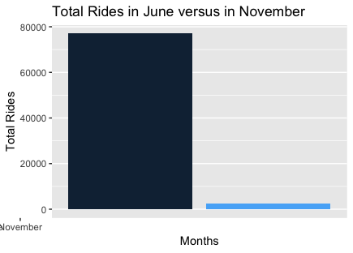
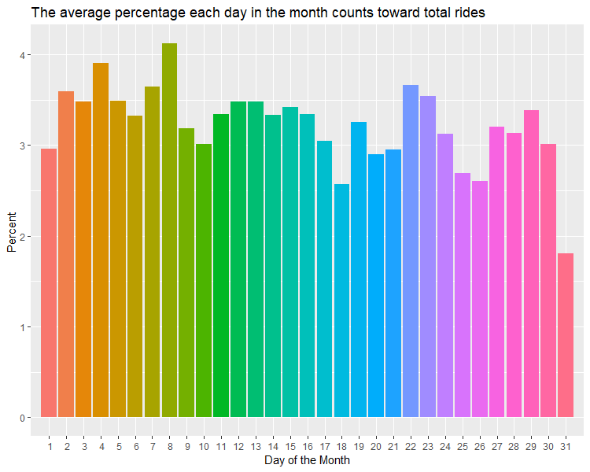
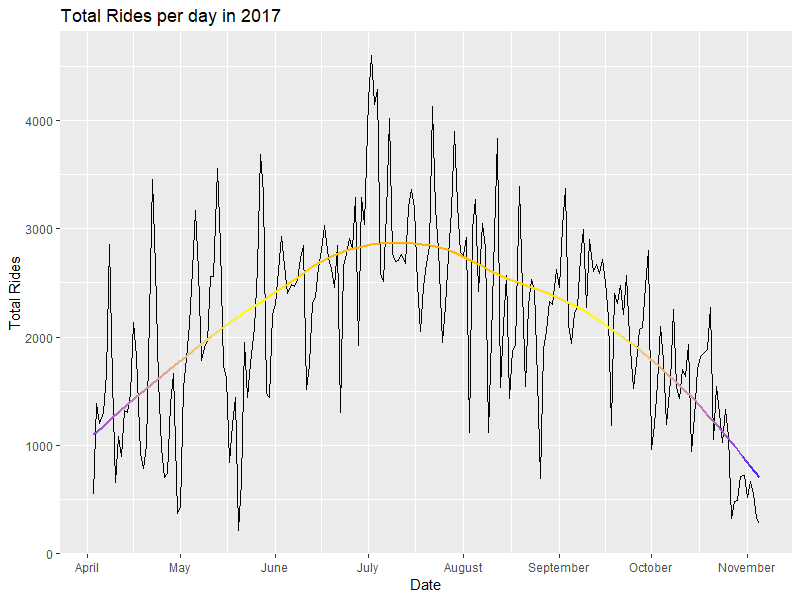
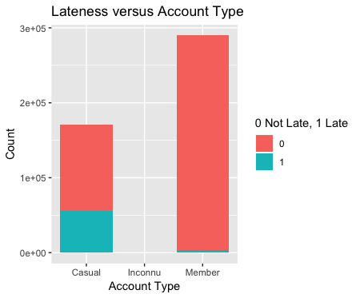

```{r setup, include=FALSE}
knitr::opts_chunk$set(echo = TRUE)
```

```{r eval= FALSE}
library(tidyverse)
library(lubridate)
```

# Overall Findings
It is clear from our analysis that most people rent bikes in the summer, non-members bring in the most revnue and the beginning of the month has, on average, more rides than the end of the month. From this, we can recomend that more resources be given to the summer months (increased bikes or advertisments), more outreach to those who do not want a membership but who want to rent a bike anyway, and more resources dedicated to the first half of the month opposed to the later half.

## Amanda (How do rides in a summer month compare to in the winter?)

I asked this question because I wanted to know how rides would compare in the summer versus in the winter, so I choose to compare all November rides to all June ones (There was no data for some months). The data shows that there are significantly more rides in the summer time than in the winter time.


```{r eval= FALSE}
bikes <- read_csv("Nice_ride_trip_history_2017_season.csv", col_names = TRUE, col_types= cols(`Start date`= col_datetime(format="%m/%d/%Y %H:%M"), `End date`= col_datetime(format="%m/%d/%Y %H:%M")))

longsLats <-read_csv("Nice_ride_2017_Station_Locations.csv", col_names = TRUE)

bikes1 <- read_csv("Nice_ride_trip_history_2017_season.csv")

bikedate <-bikes1%>%
  separate(`Start date`, into= c("Sdate", "Stime"), sep= " ")%>%
  separate(`End date`, into= c("Edate", "Etime"), sep= " ")

bikedate1 <-bikedate%>%
  separate(Sdate, into= c("Smon", "Sday", "Syear"), sep= "/")%>%
  separate(Edate, into= c("Emon", "Eday", "Eyear"), sep= "/")
#View(bikedate1)

joinedBike <- bikedate1 %>% left_join(longsLats, by = c("Start station" = "Name"))
#View(joinedBike)

colnames(joinedBike)[colnames(joinedBike)=="Longitude"] <- "StartStationLongitude"
colnames(joinedBike)[colnames(joinedBike)=="Latitude"] <- "StartStationLatitude"

joinedBike1 <- joinedBike %>% left_join(longsLats, by = c("End station" = "Name"))
 colnames(joinedBike1)[colnames(joinedBike1)=="Longitude"] <- "EndStationLongitude"
colnames(joinedBike1)[colnames(joinedBike1)=="Latitude"] <- "EndStationLatitude" 

joinedBike2 <- transform(joinedBike1, Smon = as.numeric(Smon), 
                    Sday = as.numeric(Sday))

#View(joinedBike2)
month <- joinedBike2%>%
  group_by(Smon)%>%
  count(Total= n())%>% filter(Smon=="11" | Smon=="6") %>%
  select(Smon, Total)

ggplot(data=month, aes(x=Smon, y=Total, fill=Smon)) + geom_col() + scale_x_discrete(limits = c("June", "November")) + labs(x="Months", y="Total Rides", title="Total Rides in June versus in November")  + theme(legend.position = "none")

```

## Chris

I chose to analyze the average number of rides per day. The data shows a very weak to no correlation on avergae rides taken per day, however, we can see that the beginning of the month tends to have more rides than the end of the month. 



```{r, eval= FALSE}

bikes <- read_csv("Nice_ride_trip_history_2017_season.csv", col_names = TRUE, col_types= cols(`Start date`= col_datetime(format="%m/%d/%Y %H:%M"), `End date`= col_datetime(format="%m/%d/%Y %H:%M")))

bikes1 <- read_csv("Nice_ride_trip_history_2017_season.csv")

bikedate <-bikes1 %>%
  separate(`Start date`, into= c("Begdate", "Begtime"), sep= " ")%>%
  separate(`End date`, into= c("Findate", "Fintime"), sep= " ") 

bikedays <- bikedate %>%
  separate('Begdate', into = c("month","day","year"), sep = "/") %>%
  select("month","day","year") %>%
  group_by(day) %>%
  count(Total = n()) %>%
  summarise(dailytotal = mean(n)) %>%
  arrange(desc(dailytotal)) %>%
  mutate(avgrides = (dailytotal/460718)*100)

bikedaysplot <- bikedays %>%
   transform(day = as.numeric(day)) %>%
   group_by(day) %>%
   arrange(day)

averagerides <- bikedays %>%
  summarize(averagerides1 = mean(dailytotal))

ggplot(bikedaysplot) +
  geom_col(aes(x = day , y = avgrides, fill = as.factor(day))) + labs(x = "Day of the Month", y = "Percent ", title = "The average percentage each day in the month counts toward total rides") + scale_x_discrete(limits = c(1:31, by = 1)) + theme(legend.position = "none")
```

## Anna (When is bicycle traffic the highest, and where are people going?)
I answered this question in the context of overall volume of rides per day. I sorted the data by days, not by time, as certain months in the year would throw off regular commuting data (i.e. the people who ride these bikes to work and the people who only use these bikes in the summer). 

```{r, eval= FALSE}
# Loading the Data with lubradate
bikes <- read_csv("Nice_ride_trip_history_2017_season.csv", col_names = TRUE, col_types= cols(`Start date`= col_datetime(format="%m/%d/%Y %H:%M"), `End date`= col_datetime(format="%m/%d/%Y %H:%M")))

# Loading the Data normally
bikes1 <- read_csv("Nice_ride_trip_history_2017_season.csv")

# Separating by month/year
bikedate <-bikes1%>%
  separate(`Start date`, into= c("Sdate", "Stime"), sep= " ")%>%
  separate(`End date`, into= c("Edate", "Etime"), sep= " ")

bikedate1 <-bikedate%>%
  separate(Sdate, into= c("Smon", "Sday", "Syear"), sep= "/")%>%
  separate(Edate, into= c("Emon", "Eday", "Eyear"), sep= "/")

# Putting it back into date form
bikedate2 <-bikedate1%>%
  mutate(Sdate= make_date(Syear, Smon, Sday))%>%
  mutate(Edate= make_date(Eyear, Emon, Eday))%>%
  select(Sdate, Edate, `Start station`, `End station`, `Total duration (Seconds)`)

# Summing Data
daytotal <- bikedate2%>%
  group_by(Sdate)%>%
  count(Total= n())%>%
  select(Sdate, Total)

# July Data
julytotal <- bikedate2%>%
  filter(Sdate>= as.Date("2017-07-01") & Sdate<= as.Date("2017-07-31"))

julyloc <- julytotal%>%
  group_by(`End station`)%>%
  count(Total= n())%>%
  select(`End station`, Total)

# ggplot
ggplot(daytotal)+
  geom_line(mapping= aes(x= Sdate, y= Total))+
  labs(x= "Date", y= "Total Rides", title= "Total Rides per day in 2017")+
  scale_x_date(breaks=c(as.Date("2017-04-01", origin= "1970-01-01"),
    as.Date("2017-05-01", origin= "1970-01-01"),
    as.Date("2017-06-01", origin= "1970-01-01"),
    as.Date("2017-07-01", origin= "1970-01-01"),
    as.Date("2017-08-01", origin= "1970-01-01"),
    as.Date("2017-09-01", origin= "1970-01-01"),
    as.Date("2017-10-01", origin= "1970-01-01"),
    as.Date("2017-11-01", origin= "1970-01-01")),
    labels=c("April", "May", "June", "July", "August", "September", "October", "November"))+
  geom_smooth(mapping= aes(x=Sdate, y=Total, color=..y..), se= F, show.legend= F)+
  scale_color_gradient2(low= "blue", mid="yellow", high= "red", midpoint= median(daytotal$Total))
  

RColorBrewer::display.brewer.all()

```
__Top Days for Riding a Bike in Minneapolis:__
Date        | Total 
------------| ------------- 
2017-07-02  | 4602       
2017-07-04  | 4288
2017-07-01  | 4193
2017-07-03  | 4147
2017-07-22  | 4133

__Top D Locations for Riding a Bike in Minneapois in July:__
Locaiton                             | Total        | Close Landmark
-------------------------------------| -------------|---------------
Lake Street & Knox Ave S             | 4602         | Bde Maka Ska, Lake of the Isles
11th Ave S & S 2nd Street            | 4288         | Downtown East Minneapolis
100 Main Street SE                   | 4193         | Green Space off of the Mississippi River
Lake Calhoun Center                  | 4147         | Bde Maka Ska
Washington Ave SE & Union Street SE  | 4133         | University of Minnesota



As you can see from the top five dates for renting a bike, most days fall around The Fourth of July, which is an important American holiday. The City of Minneapolis has a fireworks show near the Stone Arch Bridge, which is located near the 100 Main Street SE Location. The other locations are near outdoor landmarks like parks, lakes, or the Mississippi River. From the graph, it is easy to see that a large share of the rides come from the summer months, where one could assume that many children are out of school and many parents take their children to do outdoor activities. This dataset only had data from April to November, so one can assume that the service shut down during those months, as Minnesota gets lots of snow during the winter. 

## James (Where is the most of the revenue generated?)
To answer this question, I had to make several assumptions. In the data set, there was no way to differentiate users, which leads to counting problems. For instance, there are over 290,000 recorded member bike rides, and only 170,646 casual bike rides, but it's very likely that there are less members than casuals. For each casuals and members, there were also different subsets of each type of account, and just like before, there is no way to differentiate this. The best we can do without these numbers is to make educated guesses and from that, determine where most of the revenue comes from. 

Let's start with some simple assumptions. To start, we know that the population of Minneapolis in 2017 was just over 420,000 thousand people. Our first assumption is that one-tenth of the population has tried or consistenly used Nice Ride. This leaves us with around 42,000 people. Next, let's say that 85% of those people are casuals, and the rest are full members. So we have 35,700 casuals and 6,300 members. This was calculated by assuming that users purchase the annual membership if they bike enough so that it's cheaper than buying many single ride passes. Our final assumption to ease computation, is to assume that all the casuals use single ride passes. 

Now to calculate the revenue, we used Nice Ride's 2018 system of pricing. For a single ride pass, it costs $2 for a 30-min ride, and an additional $2 for going over the 30-min limit. For an annual member, it costs $75 dollars for unlimited 60-min rides, and $2 for each additional 30-mins.  

By filtering through the data and calculating sums, we determined a rough estimate for the amount of revenue generated by each type of user. Casuals brought in $535,228 and members brought in $486732. Note: This is a very rough estimate. There are definitely more clever ways to get better estimations for the assumptions we started with. 

Under the basis of my assumptions, I wanted to look at the ratio of being late for casuals and members. This can be seen in the plot below. Perhaps, maybe one of the reasons we came to the conclusion that casuals brought in more revenue, was that a larger proportion of them returned the bike late, which brought in extra fees. 



# What Everyone Did and What Question We Answered:
__Chris:__ I answered the question: on average, how many rides are there per day? To do this, I parsed the data into days, months, and years, and then sorted the data to reflect the daily rides. I also had to work with string conversion, and eventually, factors due to the nature of the data set. Once the data was tidy, I averaged the daily data and made a plot of my findings. The results, visualized in a geom_col graph, show that the beginning of the month has more bike rides than the ending of the month-- on average. 

__Amanda:__I answered the question: What do rides in the summer look like compared to in the winter? To do this, I split the data into months and joined the data matching the longitudes and latitudes to both the start dates and end dates. I was unable to use autoplot since I have a Macbook, but I then filtered the data by months so I could just compare one winter month to one summer one. The results show that clearly more people use the bike system in the summer months so they should use more of their resources then to get more customers.

__Anna:__ I answered the questions: What was the overall distribution of rides over the entire year, where were most rides going to, and what were the most popular dates for renting bikes and why. I used lubradate to put the date columns into a date so I could manipulate them easier. I grouped and arranged the data to find the most popular day and location. For the overall distribution of rides, I used a geom_line function to show the distribution and a geom_smooth to show the overall trend. 

__James:__ See above section.

