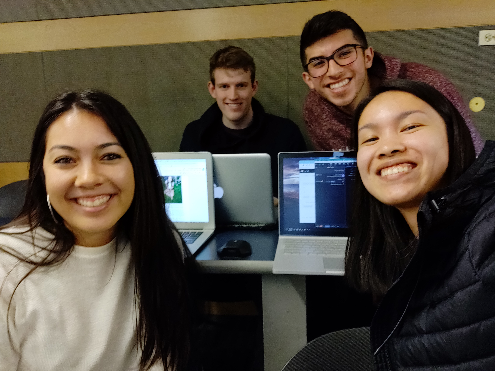

```{r setup, include=FALSE}
knitr::opts_chunk$set(echo = TRUE)
```

#Lab 2
### DataMePls(ssssss)
Our goal for the semester is to learn r programming.

__Hey look it's us__


---

## Chris


One question i'm interested in is to see political party affiliation as a function of one's highest level of education. Also party affiliation by age.

Six months after graduation, i would like to take some time to travel (and enjoy being even more broke than I was in college). 5 years after graduation, i would love to be a quant who works on wall street. 

The greatest career acomplishment that I hope to attain is to become a CFO of a moderately sized company. 

Given this goal, I hope to learn how to program in R, and more genrally, program more efficently. My coding is prettyyyy rough at the moment. 

Something fun about me is that I enjoy memes/ spend a majority of my free time laughing at memes and old vines. I also like to steep tea and do face masks. 

### Feedback
Amanda: I really like your statistics question, it seems like something that you could get a lot of data on. Your goals after college seem very reasonable; it could be improved 
                by being more specific about where you want to travel because I am curious! I liked your use of "prettyyyy" and all your other word choice--it brings out
                your personality which I think is important in an About Me bio.
Anna: It's great that you have a super specific goal for your career path after college. I wish I could have a goal as specific as you.
James: I like that your goal for the class is in direct correlation with what you want to do five years from now. I have no specific qualms overall, but I'd like to know why you want to work on wall street. 
---

## Amanda
### About Me


Question: How much does lottery of birth and the economic status that people are born into relate to a person's probability of going to college?

Six months after graduation, I want to treat myself to a vacation somewhere out of the country with a group of friends from college and never work. 
But realistically, hopefully I can get a job that relates economics, data science, and statistics in a way that makes me happy in my work environment. 
Following that, in five years, I want to feel pretty settled in a career, with genuine friends around me, and I want to be happy and fiscally independent more than anything else.

In my future career, I don't really have any specific accomplishment because I have absolutely no idea what I want my future to be like, but I feel like I will find passions once I am in the field more. 
Really, I just hope that I find a career that breeds eternal curiosity, maybe in research dealing with big data. I think learning how to code in a language that is widely used in the data science and statistics field will be very beneficial, and I am hoping to be comfortable with R by the end of this course. 


### Feedback
Chris: I think its super cool that you're interested in stats/ econ because same! They're very versatile fields, and im sure you will be able to be happy in your job since there's such a diverse selection of those jobs.
Anna: I love how you want to take a vacation after graduation! I think taking time for yourself after 4 years of college is often overlooked, so it's great that you want to do that.
James: I appreciate that not only do you want to feel settled in a career, but you also want to be happy. Many people overlook that aspect of life. Something that can be expanded on is to add it why that meme is your favorite meme. 

---

## James
### About me


One question that I'm interested in that can be answered with data is, is there a correlation between height and back problems. 

In six months, I plan on going to graduate school for applied math. Five years after that, I want to have a high paying job doing something math related. 

I'm not completely certain of what I want my greatest career accomplishment to be. I guess I want to be successful and thrive in the career I choose. 

I hope to get some exposure to data science and to learn R in this class. I'm hoping that this class will give me some clarity on what I will focus on in graduate school. 

Something interesting about myself is that I play a lot of basketball and have done so most of my life. 

### Feedback
Amanda: Your answers were very concise and too the point which I liked. I think it could be improved by getting more specific with what you want to learn 
                in the class, but overall, keep up the good work!
Chris: That's awesome that you want to go to graduate school for applied math! My current goal is to do the BS/MS program in applied math, so maybe we will be in some more classes together! Maybe you can expand upon how this class will help you choose a focus for graduate school. 
Anna: It's neat that you're going to graduate school soon. I hope this class will help you in grad school and beyond!


---

## Anna
### About Me

___A decent photo of myself___

I would like to answer the question of how large communities (or fandoms) can impact a company or brand's overall value.

Six months out of graduation, I would like to have a job that pays above minimum wage. Five years after graduation, I would like to have a job that pays better than the one I had six months out of college.

I hope my greatest career acomplisment would be that I never gave up on a project.

I hope to learn R so I can apply and be competivie for internships/careers in Data Science and Economics (or even Finance)

A fun fact about myself is that I love Animal Crossing and cannot wait until Nintendo Announces anything on their upcoming project...

___Me right now___


### Feedback
Amanda: Your About Me page was super funny and interesting to read, especially in the question about what you want to do out of college. I felt like
                I could get a good sense of your personality, which was awesome! Great job!
Chris: I think its super cool that you are into animal crossing! Nintendo has some fuego games on the switch for sure. I would love to hear an expansion upon your hypothesis for how you want to show if large communities have an impact a specific companies brand!
James: I like your funny and honest take on what you want to do out of college. I'd like to know what kind of career you are interested in. 